# Saarthi — Technical Architecture Bible

*This document assumes [PHILOSOPHY.md](PHILOSOPHY.md) (Vision & Product Philosophy)
and the Product Requirements Document as final and immutable. It does not
restate or modify either. Its job is to answer one question only: how is this
built so it survives ten years of evolution without a rewrite?*

No production code appears below. Interfaces are described as contracts, not
implementations. Diagrams use Mermaid — GitHub renders these natively.

---

## Table of Contents

1. [High-Level System Architecture](#1-high-level-system-architecture)
2. [Architectural Principles](#2-architectural-principles)
3. [Overall Module Architecture](#3-overall-module-architecture)
4. [AI Architecture](#4-ai-architecture)
5. [AI Orchestrator](#5-ai-orchestrator)
6. [Conversation Pipeline](#6-conversation-pipeline)
7. [Event-Driven Architecture](#7-event-driven-architecture)
8. [State Management](#8-state-management)
9. [Plugin Architecture](#9-plugin-architecture)
10. [AI Provider Abstraction](#10-ai-provider-abstraction)
11. [Offline Architecture](#11-offline-architecture)
12. [Data Flow](#12-data-flow)
13. [Scalability](#13-scalability)
14. [Performance](#14-performance)
15. [Security Boundaries](#15-security-boundaries)
16. [Failure Architecture](#16-failure-architecture)
17. [Future Evolution](#17-future-evolution)

---

## 1. High-Level System Architecture

Eleven layers. Two of them — Security and the Event Bus — are not "layers" in
the stacking sense at all; they are cross-cutting spines that every other layer
is required to pass through. Drawing them as a clean stack and pretending
they're independent is the single most common architecture-diagram lie, so we
draw them separately on purpose.

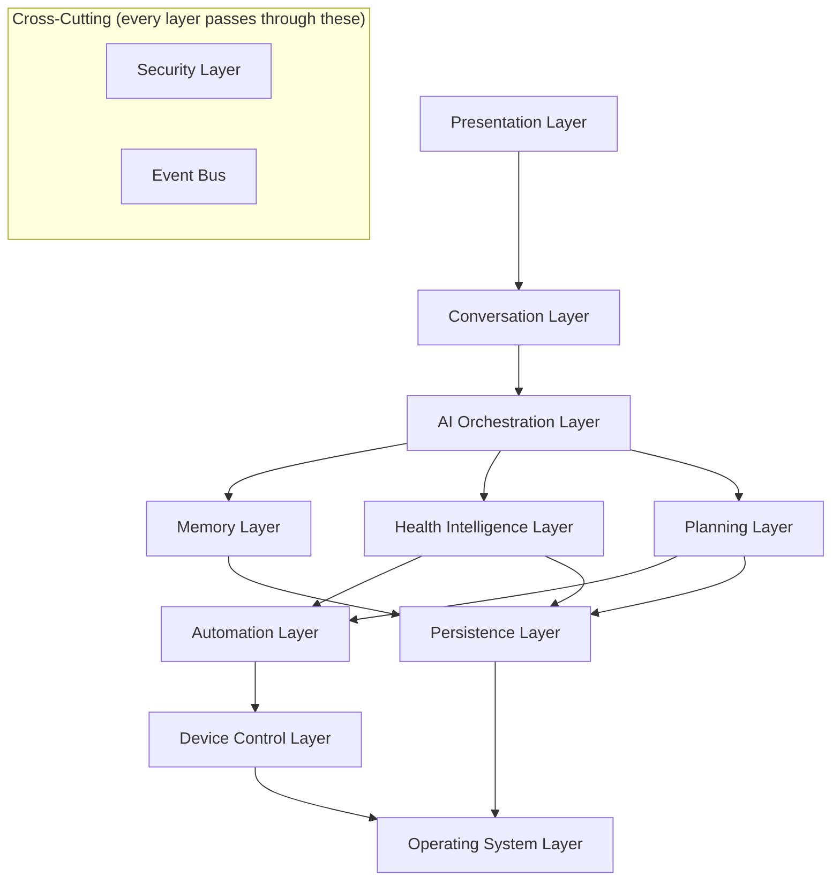

| Layer | Purpose | Responsibilities | Communication | Ownership | Failure boundary |
|---|---|---|---|---|---|
| **Presentation** | Render state, capture input, nothing else | UI for phone/tablet/watch/car/kiosk; zero business logic | Reads state via ports; sends user intents up as events | UX/Platform team per surface | A UI crash never touches background services — reminders and wake-word run in a separate process/service and outlive the Activity |
| **Conversation** | Own the "listening → speaking" pipeline | Wake word, VAD, turn-taking, dialogue state machine | Publishes `SpeechStarted/Ended` to bus; calls AI Orchestration synchronously per turn | Voice team | STT/TTS failure degrades to text input or button fallback, never a hang |
| **AI Orchestration** | Deterministic dispatcher over AI agents | Routes intents to agents, merges results, retries, times out | Calls agents via the Provider Abstraction (§10); emits `ConversationTurnCompleted` | AI Platform team | Any agent failure is caught and mapped to a defined fallback (§4) — orchestrator itself has no external dependency, so it cannot itself "go down" |
| **Memory** | The relationship's long-term record | Durable facts, routines, baselines; short-term turn context | Read/write via Persistence; read by nearly every agent | Memory/Privacy team | Memory unavailable → conversation continues context-free for that turn, never blocks |
| **Health Intelligence** | Adherence + vitals reasoning, never diagnosis | Trend detection over Memory's longitudinal data | Subscribes to `MeasurementReceived`, `MedicineConfirmed`; emits `HealthObservationRaised` | Health team | Never allowed to be a single point of failure for reminders — reminder scheduling lives in Planning, not here |
| **Planning** | Deterministic scheduling — the opposite of "AI decides" | Reminder schedules, escalation timers, routine cadence | Consumes Planner Agent proposals; owns AlarmManager-equivalent scheduling | Core Platform team | Must survive process death and reboot — this is the one layer with a zero-failure tolerance |
| **Automation** | The only layer allowed to turn an AI decision into a device action | Validates a proposed Action against Safety Agent + allow-list, then executes | Consumes validated Action objects; calls Device Control | Core Platform team | If Automation can't reach Device Control, action is queued or reported failed — never silently dropped |
| **Device Control** | Thin OS/hardware adapters | Telephony, camera/torch, audio, Bluetooth peripherals | Direct OS API calls only; publishes `DeviceStateChanged` | Platform/Android team | Each adapter fails independently — a disconnected BP monitor never affects the torch |
| **Security** *(cross-cutting)* | Trust mediation everywhere | Auth, encryption, permission mediation, audit log | Intercepts calls at Automation and Persistence boundaries | Security team | Fails closed — if Security cannot verify an action, the action does not execute |
| **Persistence** | Local-first encrypted store + optional sync | On-device DB, event log, sync/replication | Read/write API used by Memory, Health, Planning | Core Platform team | Disk full or corrupt → reminder schedule data is protected first, everything else purges before it (§16) |
| **Operating System** | The ground truth | AlarmManager, NotificationManager, SpeechRecognizer, CameraManager, etc. | Whatever the OS gives us | N/A — we adapt to it, not the reverse | Already the substrate everything above assumes can fail |

---

## 2. Architectural Principles

Each principle exists to prevent a specific, named failure — not as generic
good practice.

**Single Responsibility.** A module that both schedules reminders and talks to
Bluetooth peripherals cannot be reasoned about, tested, or replaced
independently. Every module in §3 does exactly one job.

**Dependency Inversion.** Layers depend on abstractions, never concrete
implementations — the AI Orchestrator depends on an `AiProvider` contract, never
on a Groq SDK. This single principle is the entire mechanism that makes "swap
any AI provider without rewriting the app" possible (§10). Without it, that
requirement is a slogan, not an architecture.

**Offline-first.** Every safety-critical path — reminders, calling, torch — has
a complete code path that assumes zero network, permanently. Online is an
enhancement layer bolted on top, never a dependency underneath. This exists
because the Philosophy document is explicit: safety before convenience, and an
elder's phone losing signal in a bad-coverage area is not an edge case, it's
Tuesday.

**Security by Design.** Permission checks and encryption are part of every
interface's contract from the day it's designed, not a pass added before
launch. Retrofitted security in this category — health data, elder users —
is not an acceptable risk.

**Privacy by Default.** Every new data field defaults to "not collected, not
shared" and must be deliberately opted in, never opted out. This is the
technical enforcement of the Philosophy's privacy stance, not a restatement
of it.

**Fail Gracefully.** Every component has a named degraded mode. There is no
component in this system permitted to have "crash" as its only failure
behavior — see §16 for the full failure catalogue.

**Human Override.** Every automated or AI-triggered action has a manual
cancel/override path, and select actions (§8 of the Ethical Principles)
require standing human confirmation before they can execute at all.

**AI Never Executes Directly.** A language model's output is data — a typed,
schema-validated proposed Action — never a command, a shell call, or an API
invocation. The only thing permitted to call an OS or device API is the
Automation Layer's deterministic executor. This is simultaneously an ethics
requirement (Philosophy: "AI never executes directly") and the project's core
defense against prompt injection: a hostile or malformed model output can, at
absolute worst, be a well-typed Action object that fails the Safety Agent's
allow-list check. It can never be an arbitrary instruction.

**Every Action Must Be Verifiable.** Every executed action is written to an
append-only audit log — what triggered it, which agent proposed it, who or what
approved it, when it ran. This is what makes the Caregiver module trustworthy
and what makes a security incident investigable after the fact instead of
merely suspected.

**Stateless AI.** Every call to a model is a pure function: (context passed in)
→ (structured output). No agent, and no provider, holds session state between
calls — all state lives in the Memory Layer, under our control, in our schema.
This is what makes provider-swapping possible (a new provider needs no
migration of "threads" or "assistants"), and it's what makes multi-device
continuity possible (§13) — the phone and the future watch can both read the
same Memory Layer, because no relevant state was ever trapped inside a vendor's
proprietary session object.

**Deterministic Business Logic.** Scheduling, escalation timing, and retry
cadence are plain, testable code — never an LLM's runtime judgment call. An
82-year-old's medicine alarm firing "approximately on time, usually" because a
model decided so at inference time is not an acceptable design. Determinism
here is a direct expression of "trust over intelligence."

**Event-Driven Communication.** Modules communicate by publishing and
subscribing to named events on a central bus, not by holding direct references
to each other. This is what lets new modules (§9, plugins) be added by
subscribing to existing events, without modifying a single line of the modules
that publish them.

**CQRS — applied selectively.** The write path (`MedicineConfirmed`,
`ReminderScheduled`) and the read path ("what's due today") have very
different shapes and very different criticality in the Health and Planning
modules, and are modeled separately there. It is deliberately **not** applied
uniformly — Device Control's "read torch state / set torch state" has no
meaningful command/query asymmetry, and forcing CQRS onto it would be
architecture theater.

**DDD — bounded contexts, not a shared model.** Each module in §3 owns its own
definition of its core concepts. Health's notion of a "dose" is not the same
object as Notifications' notion of a "reminder" — they are related through an
explicit translation at the module boundary, not a single shared God-object
that every team quietly mutates. This is what keeps fourteen modules from
becoming one, over ten years, by a thousand small conveniences.

---

## 3. Overall Module Architecture

Fourteen bounded contexts. The dependency graph below encodes a hard rule:
**arrows only point from feature modules toward foundation modules, never the
reverse.** Security, Settings, and Memory have zero knowledge of Health,
Emergency, or Caregiver. This is what prevents the "everything imports
everything" decay that kills most decade-old codebases.

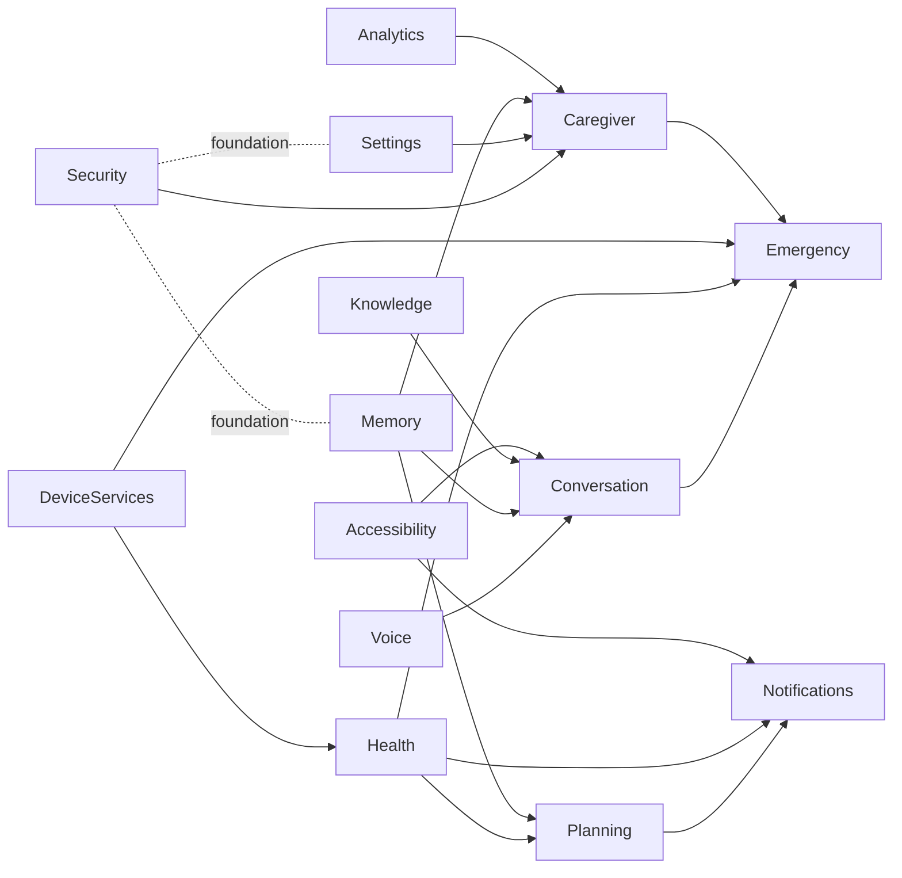

| Module | Responsibilities | Public interface (conceptual) | Internal components | Depends on | Expansion strategy | Owns |
|---|---|---|---|---|---|---|
| **Voice** | Wake word, STT, TTS | `listen() → transcript`, `speak(text, profile)` | Wake-word detector, STT router, TTS engine | *(none — leaf module)* | New languages = new Language Pack registration, no code change | Voice team |
| **Conversation** | Turn-taking, dialogue state | `handleTurn(transcript) → Response` | Turn state machine, context assembler | Voice, Memory, Knowledge, Accessibility | New surfaces plug in a new Presentation adapter | Voice team |
| **Memory** | Long-term relationship record | `remember(fact)`, `recall(query) → facts` | Durable store, working-memory cache, Summarization Agent hook | Persistence, Security | New fact types are schema additions, not new subsystems | Memory/Privacy team |
| **Planning** | Deterministic scheduling | `schedule(item)`, `dueNow() → items` | Alarm scheduler, escalation timer, `ReminderType` registry | Health, Memory, Persistence | New reminder types register a descriptor (§9) | Core Platform |
| **Notifications** | Delivery of anything that must reach the person | `deliver(alert, urgency)` | Full-screen intent path, standard notification path, fallback ladder | Planning, Health, Accessibility | New delivery channels (watch haptic, speaker chime) register a channel adapter | Core Platform |
| **Accessibility** | Adapts pacing/complexity/modality | `adapt(response, profile) → Response` | Profile detector, pacing rules | *(none — cross-feature, called by many)* | New conditions add a profile + adaptation rule set | Accessibility team |
| **Device Services** | Hardware adapters | `capabilities()`, `execute(deviceAction)` | Torch, telephony, audio, Bluetooth peripheral adapters | *(none — leaf module)* | New hardware = new adapter implementing the same contract (§9) | Platform/Android team |
| **Knowledge** | General Q&A, explicitly non-medical | `answer(query) → Response` | Knowledge Agent invocation, topic guard | Security (for the medical-topic block-list) | New domains are prompt/tooling additions | AI Platform |
| **Analytics** | Success metrics (Philosophy §11) only — never raw surveillance | `record(metric)` | Aggregation, on-device rollups | Security | New metrics are additive, never retroactively expand what's collected | Product/Data team |
| **Emergency** | Detection + escalation | `evaluate(signal) → EmergencyState` | Fall/anomaly heuristics, escalation ladder | Conversation, Health, Device Services, Caregiver | New signal sources publish events this module already subscribes to | Health/Safety team |
| **Settings** | Elder + caregiver configuration | `get/set(preference)` | Preference store, consent registry | Security | New preferences are schema additions | Core Platform |
| **Security** | Auth, encryption, permission mediation, audit | `authorize(action) → bool`, `audit(event)` | Local auth, keystore-backed crypto, audit log | *(none — foundation module)* | New action types register their required authorization level | Security team |
| **Caregiver** | Consent-graduated family visibility | `digest() → CaregiverView` | Consent filter, digest composer | Security, Settings, Memory, Analytics | New surfaces (portal, app) consume the same digest contract | Product/Trust team |
| **Health** | Adherence + vitals reasoning | `observe(measurement) → Observation` | Health Agent invocation, baseline model | Device Services, Memory | New device types plug in via the Health Device Adapter (§9) | Health/Safety team |

---

## 4. AI Architecture

No single giant prompt. Twelve narrow, single-purpose agents, each a pure
function over a shared **Turn Context**, each independently swappable, each
individually constrained about what it is and is not allowed to decide.

| Agent | Purpose | Inputs | Outputs | Reads/writes memory | Failure mode | Executes when | Never executes when |
|---|---|---|---|---|---|---|---|
| **Conversation** | Compose the natural-language reply | Transcript, retrieved memory, emotional state | Draft reply text | Reads working memory | Falls back to a plain acknowledgment template | Every conversational turn | Never proposes device actions itself |
| **Memory** | Extract durable facts; retrieve relevant context | Transcript, existing memory graph | New facts to store; relevant facts for this turn | Reads + writes long-term memory | Retrieval failure → turn proceeds with no injected context, never blocks | Every turn (retrieval); nightly + post-turn (extraction) | Never decides to take an action |
| **Planner** | Propose schedule changes | Transcript, existing schedule | Proposed schedule diff (not applied) | Reads Planning state | Proposal simply dropped; Planning Layer keeps existing schedule | When a scheduling-relevant utterance is detected | Never writes the schedule directly — Planning Layer applies deterministically |
| **Health** | Reason over adherence/vitals trends | Measurement stream, baseline | A bounded `Observation` enum value — never free text | Reads Health/Memory baseline | Silently skips this cycle's observation; never guesses | On new measurement or nightly trend pass | **Never** emits a diagnosis, a medical label, or free-text medical claims |
| **Emotion** | Estimate affect from tone/word choice/silence | Transcript, audio prosody signal, recent history | Emotional-state estimate + suggested tone register | Reads recent conversational history | Defaults to neutral register | Every turn | Never composes or sends a message directly to the user |
| **Knowledge** | General Q&A | Transcript | Answer text | Reads nothing sensitive | Declines gracefully: "I'm not sure" | Non-medical, non-action questions | Never answers medical/diagnostic questions — routed to Health Agent's bounded output or declined |
| **Safety** | Validate every proposed action against ethical rules | Any proposed Action from any agent | Approve / reject / require-human-confirmation | Reads Security's allow-list | **Fails closed** — an error here blocks the action, never allows it | On every proposed action, always, no exceptions | Never itself proposes actions — only judges them |
| **Automation** | Translate an approved intent into a structured Action | Approved intent + contact/entity resolution | Typed Action object | Reads Contacts/Settings | Returns "cannot resolve," never guesses a target | When an actionable intent is classified | Never calls a device API directly — hands off to the Automation Layer executor |
| **Device** | Query/control a single device primitive | Device state request | Device state / single primitive command | Reads Device Services state | Reports device unavailable | For single-primitive requests (torch, volume) | Never orchestrates multi-step device sequences — that's the Automation Agent |
| **Accessibility** | Adapt any other agent's output for this person's profile | Draft response + accessibility profile | Adapted response | Reads Settings' accessibility profile | Passes the draft through unmodified | On every outbound response | Never originates content — post-processes only |
| **Caregiver** | Propose what belongs in the family digest | Recent activity, consent settings | Proposed digest items | Reads Analytics, Memory (consented scope only) | Digest simply omits this cycle's item | Nightly, or on a consented real-time trigger | Never has write access to the portal — a deterministic consent filter is the actual gate |
| **Summarization** | Compress the day's raw logs into durable memory; purge raw transcripts | Raw conversation/audio logs | Compact memory entries; deletion instructions | Writes long-term memory; deletes raw logs | Skips compaction this cycle; raw logs simply age out under a hard TTL instead | Nightly, batch | Never runs synchronously in the conversational path — it is always offline/batch |

---

## 5. AI Orchestrator

The Orchestrator is deterministic dispatch code — it is explicitly **not**
itself an LLM call. Its job is to decide *which* agents run and in what order,
not to reason about the user's request.

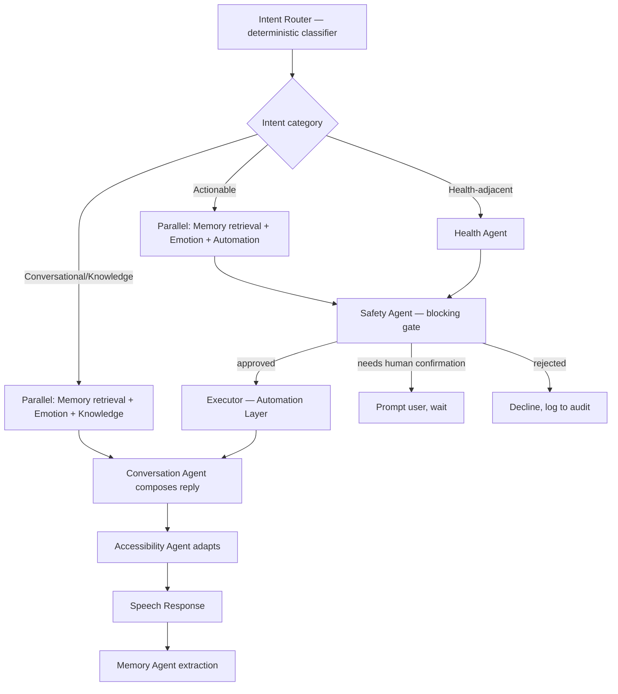

- **Which agents run:** decided by a deterministic routing table keyed on the
  classified intent category — not by asking a model "which agents should I
  call." This keeps routing auditable and instantly debuggable.
- **Execution order:** independent read-agents (Memory retrieval, Emotion,
  Knowledge/Health) run in parallel against a shared, immutable **Turn Context**
  assembled once per turn. Anything that depends on another agent's output
  (Safety depending on Automation's proposed Action) runs strictly after.
- **Context sharing:** the Turn Context (transcript, retrieved memory, user
  profile, accessibility profile) is built once and passed by reference —
  no agent re-fetches what another already fetched.
- **Result merging:** a fixed pipeline order, not a free-for-all — Conversation
  Agent drafts, Accessibility Agent adapts pacing/complexity, only then does
  TTS run. Order is code, not a model decision.
- **Conflict resolution:** if two agents propose conflicting actions in the
  same turn, a static priority table resolves it (safety/emergency actions
  always outrank convenience actions) — never a model vote.
- **Retry logic:** exponential backoff, capped at 2 retries per agent call,
  each agent's defined fallback (table in §4) kicks in once retries are
  exhausted.
- **Timeout strategy:** tiered. The safety-critical path (medicine
  confirmation, emergency) has the shortest timeout and an immediate
  deterministic fallback — it never waits on a network call. The
  conversational/knowledge path can tolerate a longer timeout since the stakes
  are lower.
- **Fallback strategy:** every agent's cloud-model call has a defined
  degraded substitute — this generalizes the pattern already proven in the
  existing codebase (Groq-backed understanding falling back to a deterministic
  keyword parser when offline or unavailable) into a first-class, universal
  architectural rule rather than a one-off `if (key.isBlank())` check.

---

## 6. Conversation Pipeline

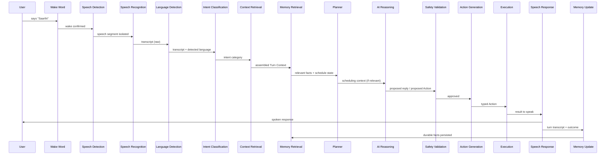

| Stage | Owner | What it does | Offline capable | Latency budget |
|---|---|---|---|---|
| Wake Word | Voice module | Detects the name continuously, low power | Yes, always | <500ms |
| Speech Detection (VAD) | Voice module | Isolates the speech segment from silence/noise | Yes, always | <200ms |
| Speech Recognition | Voice module via Provider Router | Transcribes audio to text | Degraded (Tier 2/3, §11) | <1s on-device, <2s cloud |
| Language Detection | Conversation module | Identifies spoken language, incl. code-switching | Yes (heuristic), better online | <100ms |
| Intent Classification | AI Orchestrator | Deterministic routing category | Yes (keyword tier), better online | <200ms |
| Context Retrieval | Memory module | Assembles the Turn Context | Yes, always | <150ms |
| Memory Retrieval | Memory module | Fetches relevant durable facts | Yes, always (local store) | <150ms |
| Planner | Planning module | Supplies current schedule state if relevant | Yes, always | <100ms |
| AI Reasoning | Relevant agents (§4) | Produces reply / proposed Action | Degraded offline (§11) | <1.5s p50 cloud |
| Safety Validation | Safety Agent | Blocking approval gate | Yes, always (rule-based, local) | <50ms |
| Action Generation | Automation Agent | Typed Action object | Yes, always | <50ms |
| Execution | Automation Layer → Device Control | Calls the OS/device API | Yes, always | <200ms |
| Speech Response | Voice module | TTS playback | Yes, always | <300ms to first audio |
| Memory Update | Memory + Summarization Agent | Persists durable facts | Yes, always | Async, non-blocking |

---

## 7. Event-Driven Architecture

A single append-only Event Bus. Every safety-critical event is durably
persisted **before** being considered delivered — this is what lets a
reminder survive a process death or reboot, generalizing the pattern already
proven by the existing Alarm/Boot-receiver reminder implementation.

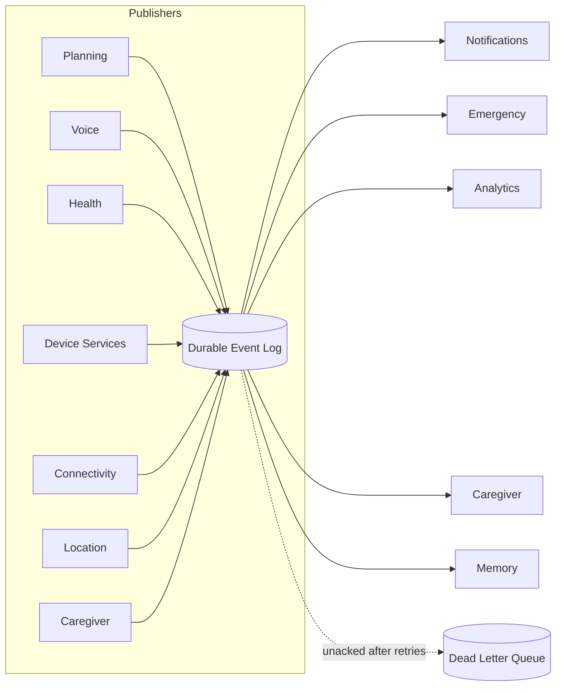

| Event | Publisher | Subscribers |
|---|---|---|
| `WakeWordDetected` | Voice | Conversation |
| `SpeechStarted` / `SpeechEnded` | Voice | Conversation, Analytics |
| `MedicineReminderTriggered` | Planning | Notifications, Analytics |
| `MedicineConfirmed` | Notifications (user action) | Planning, Health, Caregiver, Analytics |
| `EmergencyDetected` | Emergency | Notifications, Caregiver, Device Services (call) |
| `CallCompleted` | Device Services | Analytics, Memory |
| `BatteryLow` | OS Layer adapter | Automation (suppress non-critical work), Notifications |
| `DeviceOffline` | Connectivity adapter | AI Orchestrator (trigger Tier 2/3), Notifications |
| `LocationChanged` | Location adapter (opt-in only) | Emergency (last-known-location only) |
| `CaregiverAlertSent` | Caregiver | Analytics |
| `ConsentChanged` | Settings | Caregiver, Analytics, Memory |
| `ProviderFailover` | AI Orchestrator | Analytics, Diagnostics |

- **Event lifecycle:** created → written to the durable log (write-ahead) →
  dispatched to subscribers → each subscriber acknowledges independently →
  archived once all required acknowledgments are in.
- **Persistence:** the log is append-only local storage; safety-critical
  events (`MedicineReminderTriggered`, `EmergencyDetected`) are never
  considered "sent" until they're durably written, so a crash between
  scheduling and delivery cannot silently lose a reminder.
- **Retry:** per-subscriber acknowledgment with exponential backoff; a
  subscriber that keeps failing (e.g., a caregiver push notification service
  being down) does not block the event for other subscribers.
- **Dead-letter queue:** events that exhaust retries land here for later
  inspection via a diagnostics surface — never silently discarded.
- **Event replay:** any new endpoint (a future watch, a restored install)
  reconstructs current state by replaying the log rather than needing a
  bespoke sync protocol — this is the mechanism that makes §13's multi-device
  future tractable without inventing a second synchronization system later.

---

## 8. State Management

| State machine | Persistence | Why |
|---|---|---|
| Conversation State | Ephemeral (in-memory) | A conversation turn is not safety-critical to survive a crash — restarting clean is correct |
| Reminder State | Durable, must survive reboot | The single highest-stakes state in the system |
| Emergency State | Durable | An in-progress emergency must not be lost to a crash |
| Routine State | Durable | Long-horizon pattern tracking |
| Call State | Ephemeral | Delegated to and owned by the OS telephony stack |
| Wake Word State | Ephemeral | Re-arms instantly on process restart |
| Device State | Durable (last-known), refreshed on reconnect | Needed to detect "overdue reading" even if the app was closed |
| Network State | Ephemeral | Recomputed continuously from the OS |

Reminder State is the one worth diagramming, since it is the state machine the
whole safety story rests on:

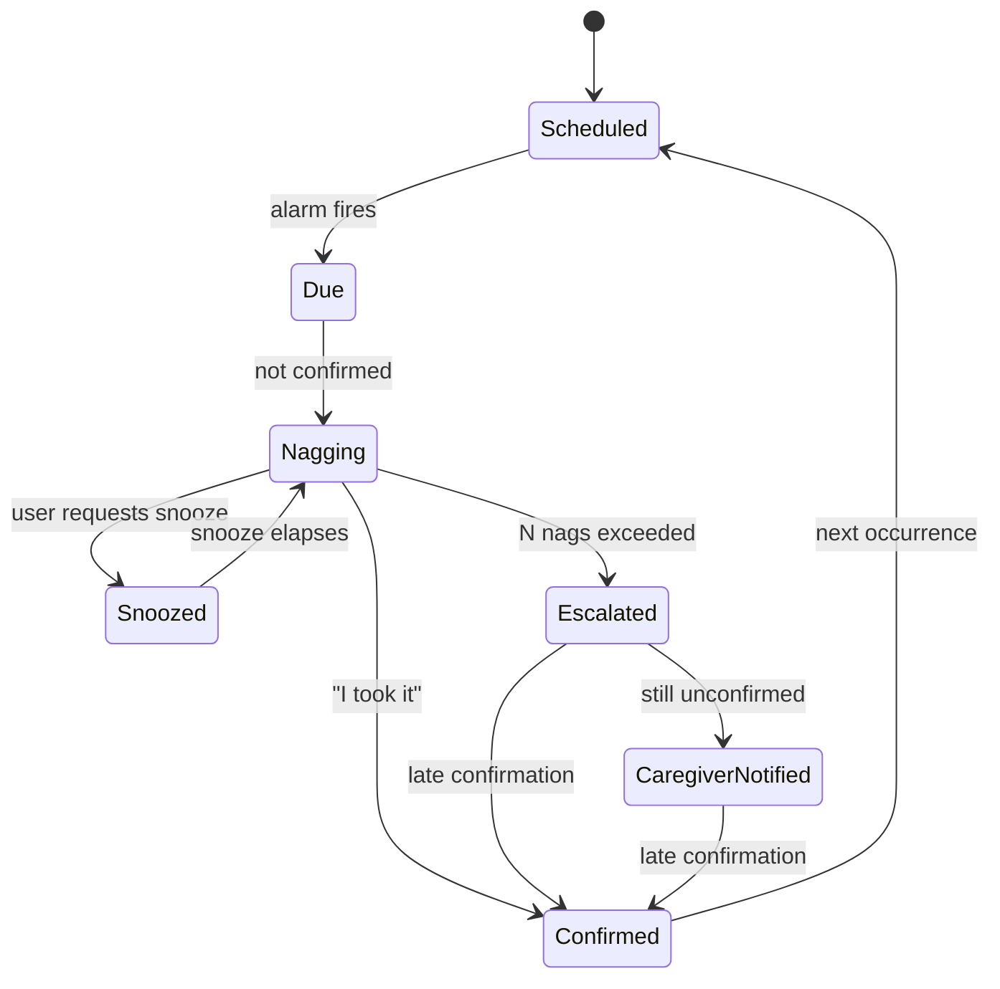

- **Transitions** are owned entirely by the Planning module — never inferred
  by an AI agent at runtime.
- **Recovery:** on process restart or reboot, Planning re-derives current
  state from the durable log rather than trusting in-memory state — this is
  why the boot-receiver-style reschedule pattern is architecturally required,
  not incidental.
- **Synchronization:** in a multi-device future (§13), Reminder State is the
  first state machine that must be kept consistent across surfaces (confirming
  on the watch must cancel the phone's nag) — solved via the same durable
  event log and replay mechanism from §7, not a bespoke sync protocol.
- **Persistence:** every durable state machine above is written through the
  Persistence Layer's encrypted local store before being considered
  authoritative.

---

## 9. Plugin Architecture

New capabilities register against stable contracts. The core never imports a
plugin-specific type.

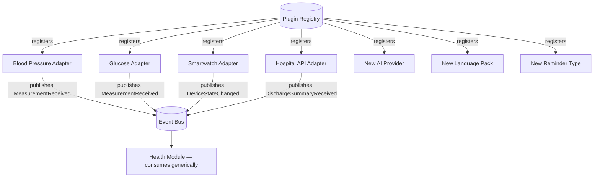

| Extension point | Contract | Core dependency |
|---|---|---|
| Health device (BP monitor, glucose monitor, any Bluetooth peripheral) | `connect()`, `readings() → stream<Measurement>` | Health module consumes generic `MeasurementReceived` events only — never a vendor SDK type |
| Smartwatch / new surface | Presentation adapter + thin Device Control adapter | Core reasoning stack (Conversation/AI/Memory/Planning) is completely surface-agnostic |
| Hospital / clinical system | `ClinicalIntegrationAdapter` publishing `DischargeSummaryReceived` | Memory/Health subscribe generically, no per-hospital-API code in core |
| New AI model/provider | Implements the `AiProvider` capability contract (§10) | Zero core changes — register and go |
| New language | Language Pack: STT/TTS locale + phrase/tone pack + wake-word variants | Conversation pipeline is locale-parameterized, not locale-hardcoded |
| New reminder type (appointment, hydration, exercise) | `ReminderType` descriptor: schedule shape + confirmation requirement + escalation policy | Planning operates on the generic `Reminder` abstraction; Medicine is just one registered instance of it |

---

## 10. AI Provider Abstraction

The application depends on three narrow **capability contracts** —
Transcription, Generation, Synthesis — never on a specific vendor SDK. A
provider registers support for one, two, or all three.

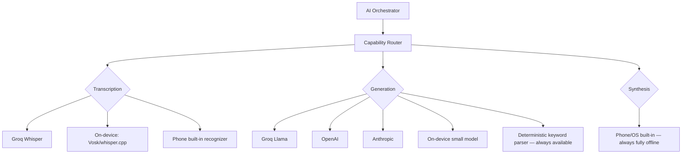

| Provider | STT | Generation | TTS | Hosting | Offline | Notes |
|---|---|---|---|---|---|---|
| Groq (Whisper + Llama) | Yes | Yes | — | Cloud, free tier | No | Current default — very low latency (custom inference hardware) |
| OpenAI | Yes | Yes | Yes | Cloud | No | Broadest ecosystem, higher cost at scale |
| Anthropic | — | Yes | — | Cloud | No | Strong reasoning/safety behavior |
| Google | Yes | Yes | Yes | Cloud | No | Strong multilingual coverage |
| Ollama | — | Yes | — | Self-hosted server | Home-network only | Not true offline — still needs the phone to reach a server (see Philosophy discussion of this trade-off) |
| llama.cpp / on-device | Yes (via Vosk/whisper.cpp) | Yes (1–3B class) | — | On-device | Yes | Meaningfully lower capability; the only tier with zero network dependency for reasoning |
| Deterministic parser | — | Yes (keyword-only) | — | On-device | Yes | The guaranteed floor — always available, zero AI dependency |

- **Provider switching** means implementing the capability contract and
  registering with the Capability Router — nothing else in the codebase
  changes, by construction of Dependency Inversion (§2).
- **Capability discovery:** each provider self-reports a manifest at
  registration (supported languages, capabilities, rough latency/cost class),
  so the Router can make an informed choice rather than a hardcoded one.
- **Graceful degradation:** every capability has a defined ladder — cloud
  (best) → on-device model (degraded) → deterministic rule-based (guaranteed).
  The deterministic floor for Generation is what already exists in the
  codebase's keyword-based command parser; this architecture formalizes that
  pattern as the universal, required bottom rung for every capability, not a
  one-off fallback.

---

## 11. Offline Architecture

| Capability | Offline status | Fallback tier |
|---|---|---|
| TTS (speaking) | **Fully offline, always** | OS built-in engine — no degradation at all |
| Memory (read/write) | **Fully offline, always** | Local-first encrypted store; sync is optional enhancement |
| Scheduling / reminders | **Fully offline, always** | Deterministic Planning Layer, OS alarm APIs |
| Device control (torch, volume, calling) | **Fully offline, always** | Direct OS API calls, zero network |
| Emergency detection + response | **Fully offline, always (hard requirement)** | Local heuristics + direct-dial, never gated on connectivity |
| STT | Degraded offline | Tier 2 (on-device model) or Tier 3 (phone's built-in recognizer) |
| Generation / understanding | Degraded offline | Tier 2 (small on-device model) or Tier 3 (keyword parser) |
| Knowledge (general Q&A) | Degraded offline | Tier 2 on-device model, or a curated local FAQ cache; full "ask anything" is an online-enhanced capability, not a guarantee |
| Health anomaly detection | Degraded offline | Lighter on-device heuristic vs. richer online pattern detection |
| Translation / any-language understanding | **Most degraded offline** | Limited to whatever language packs are pre-bundled; true universal offline translation is not achievable without a real per-language storage/engineering cost, and we say so plainly rather than overclaiming it |

The fallback hierarchy is the same three-tier ladder everywhere it applies:
**Tier 1 (cloud, best quality) → Tier 2 (on-device model, degraded quality) →
Tier 3 (deterministic, guaranteed availability).** Capabilities that are
inherently local — TTS, Memory, Scheduling, Device Control, core Emergency
response — are "always Tier 3-equivalent" by design, which is precisely why
they were named as non-negotiable, always-offline requirements in the
Philosophy document.

---

## 12. Data Flow

Two representative flows — the highest-stakes ones. Every other scenario
(general Conversation, Knowledge query, Routine planning) follows the same
shape as the pipeline already diagrammed in full in §6; repeating it here
would be redundant, not additive.

**Medicine reminder** — Planning-initiated, not conversation-initiated:

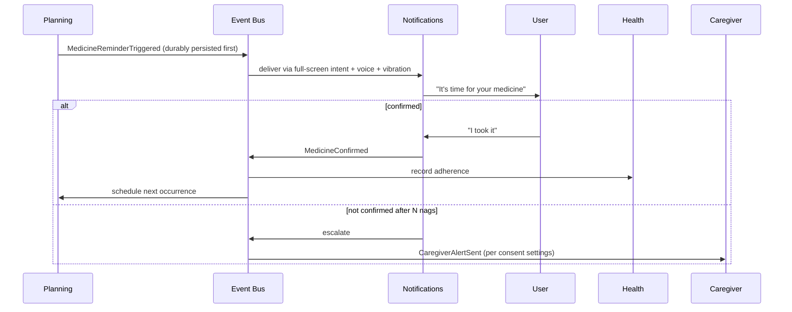

**Emergency** — a compressed path that bypasses normal conversational
turn-taking entirely:

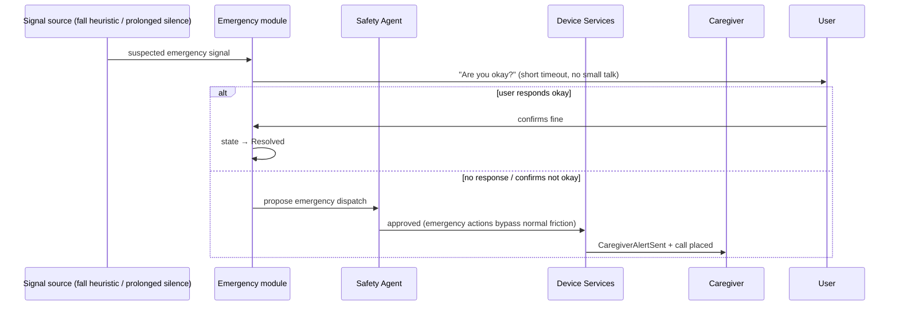

---

## 13. Scalability

| Dimension | Design implication |
|---|---|
| One user | No backend required at all — matches today's reality exactly: everything local-first, zero server dependency |
| Ten million users | If/when a sync or family-portal backend exists, it is **household-scoped and end-to-end encrypted from day one**, not a general cloud database of raw health data retrofitted with access controls later. Centralized sync is a trade-off we accept only where it earns its keep (caregiver portal continuity), never as a default data path |
| Phone | Today's primary Presentation + full Device Control surface |
| Tablet | Same core, a larger-format Presentation adapter only |
| Wearable | A **thin client**: subscribes to the Event Bus, minimal local UI, no local AI Orchestration — all reasoning stays on the phone/cloud. The watch is a presentation + sensor surface, nothing more |
| Smart TV | Presentation-heavy, largely passive display, minimal interactivity |
| Smart Speaker | Voice-only Presentation adapter, no screen at all |
| Car | A safety-constrained Presentation adapter + a new Device Control adapter for vehicle telemetry |
| Hospital kiosk | **Architecturally distinct deployment** — closer to a session-scoped instance than a lifelong companion, since the trust model (no persistent personal memory across strangers) is fundamentally different. Flagged explicitly rather than quietly forced into the same Memory model |

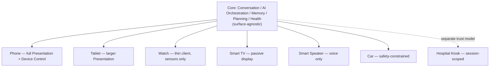

The payoff of the layered/modular design is exactly this diagram: most new
device classes are a new Presentation + Device Control adapter against an
unchanged core, not a rewrite.

---

## 14. Performance

| Metric | Target | Why |
|---|---|---|
| Cold start | < 2s to first interactive frame | Standard for "waiting on you" software |
| Warm start | < 500ms | Re-entry should feel instant |
| Wake word detection | < 500ms from utterance end | Responsiveness of the entire hands-free premise depends on this |
| AI latency (cloud) | < 1.5s p50 / < 3s p95 | Groq's inference hardware makes this realistic; a slower provider changes the user-perceived quality of the whole product |
| AI latency (on-device fallback) | < 3s p50 | Lower expectation is acceptable and should be communicated as such, never hidden |
| Reminder trigger accuracy | within ±30s of scheduled time, even under OS Doze/battery optimization | This is a real Android constraint, not a theoretical one — justifies `SCHEDULE_EXACT_ALARM` usage and the battery-optimization exemption already required in this project |
| Speech round-trip (STT) | < 1s on-device, < 2s cloud incl. network | User-perceived responsiveness |
| Wake-word battery drain | < 3–5% per day incremental | Always-on listening is a real, hard battery trade-off; a dedicated low-power detection path (DSP/lightweight model) is preferred over CPU polling wherever hardware allows |
| Background service memory | < 150MB resident | Budget/older elder phones are the target population (minSdk 26) and are aggressively killed by the OS low-memory killer above this |
| Storage growth | Bounded via nightly Summarization Agent compaction | Prevents unbounded raw-transcript accumulation — a privacy requirement as much as a performance one |
| Network | Designed for low-bandwidth/high-latency connections | Rural connectivity is a normal condition for this population, not an edge case; safety-critical calls get minimal payload and highest priority |

---

## 15. Security Boundaries

| Zone | Trust level | Treatment |
|---|---|---|
| On-device app process, encrypted local store, OS-mediated permissions | Trusted | Full internal access, still permission-gated per module |
| AI provider responses | **Untrusted input** | Always schema-validated; never allowed to trigger an unvalidated action — this is the literal prompt-injection defense, not a separate feature |
| Cloud (any provider) | Untrusted, treated as a data processor | Minimal per-turn context sent, never a persistent memory dump |
| Bluetooth/plugin device data | Untrusted until validated | Validated against expected measurement schema before being trusted |
| Caregiver portal requests | Separately authenticated/authorized | Never inherits the elder device's trust implicitly |
| User/health data at rest | Highest sensitivity | Keystore-backed encryption; leaves the device only via explicit, consented, end-to-end encrypted sync |
| Secrets (API keys) | Never in source control | Per-device provisioning preferred over one shared static key baked at build time — a lesson directly drawn from this project's own history of a key being exposed in a development conversation |
| Permissions | Least-privilege, contextual | Requested at point of need, mediated and logged by the Security Layer |
| Authentication | **Open decision, not yet made** | Where it plugs in: local device authentication (PIN/fingerprint) gates the Presentation Layer's entry point; this decision was deferred during the Philosophy phase and remains open — this architecture reserves the slot without prejudging the answer |
| Authorization | Capability-based, not binary admin/user | Elder-level (full control of their own device), caregiver-level (scoped to consented digest only), plugin-level (a BP monitor can publish measurements, never read Memory or trigger Automation) |

---

## 16. Failure Architecture

Assume every one of these fails, simultaneously if necessary.

| Failure | Degraded behavior | Never happens |
|---|---|---|
| Internet down | Tier 2/3 fallback for AI; reminders, calling, torch unaffected | AI dependency blocking a safety-critical path |
| AI provider down (net up) | Capability Router fails over to next registered provider, or drops a tier | Silent hang waiting on a dead provider |
| Speech recognition fails | Asks user to repeat; offers button fallback after N failures | Silently guessing at what was said |
| Phone can't call (no SIM/airplane mode) | Detected at Device Control, plainly stated, WhatsApp-call suggested if available | Pretending the call succeeded |
| Battery critical | Non-critical background work suppressed | Medicine reminders or emergency detection ever suppressed |
| Permissions revoked mid-use | That specific capability degrades; rest of app unaffected | A whole-app crash from one revoked permission |
| GPS unavailable | Falls back to last-known location, asks the user | A silently failed emergency location step |
| Bluetooth peripheral disconnects | Health continues on self-report; alerts if an expected reading is overdue | Silent data gap with no signal to anyone |
| Camera unavailable (in use elsewhere) | Torch reports unavailable, offers retry | Undefined/crashing behavior |
| Storage full | Oldest non-critical logs purge first via compaction | Reminder schedule data ever purged or corrupted |
| Notifications blocked at OS level | Falls back to a full-screen intent Activity — the reason the current implementation already uses this pattern, not a standard notification, for the loudest path | A missed reminder because a notification was silently swallowed |

---

## 17. Future Evolution

Every direction below is reachable as **a new Presentation + Device Control
adapter, and occasionally a new Plugin registration** — never a redesign of
Conversation, AI Orchestration, Memory, Planning, or Health, because those
layers were built surface-agnostic from the start.

- **Robot** — a new Device Control adapter for locomotion/manipulator
  actuators, plus a physically expressive Presentation Layer. Reasoning stack
  unchanged.
- **Smart glasses** — a new visual-overlay Presentation Layer and an
  always-on-camera Device Control adapter. Same core.
- **Wearables** — already covered in §13 as a thin client; no new
  architectural category needed.
- **Medical ecosystem** — an expansion of the Health Device Adapter contract
  (§9) to more device types and hospital integrations; Health Intelligence's
  interfaces do not change, only the number of Measurement sources feeding
  them.
- **Ambient AI** (always-present, multi-room, multi-surface) — the hardest
  evolution, and the one that most directly stress-tests the Event Bus and
  state-synchronization design from §7/§8. This is the reason those two
  sections were designed for multi-device replay from day one, rather than
  "when we need it."
- **Predictive healthcare** — an evolution of the Health Agent and Memory
  Layer's longitudinal baseline modeling (already the entire thesis of the
  Philosophy's AI Philosophy section: proactive modeling of one person's
  normal). This is primarily a model/data-science evolution against an
  existing interface, not a new architectural layer.

The point of every choice in this document is that this list is short and
boring to build against. If any of these required touching Conversation, AI
Orchestration, Memory, Planning, or Health, the architecture would have
already failed at something more immediate.
