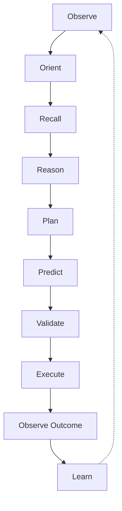
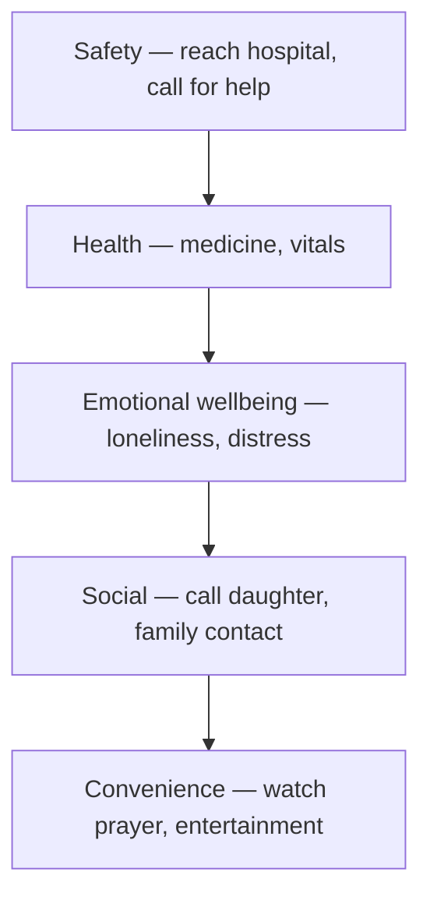
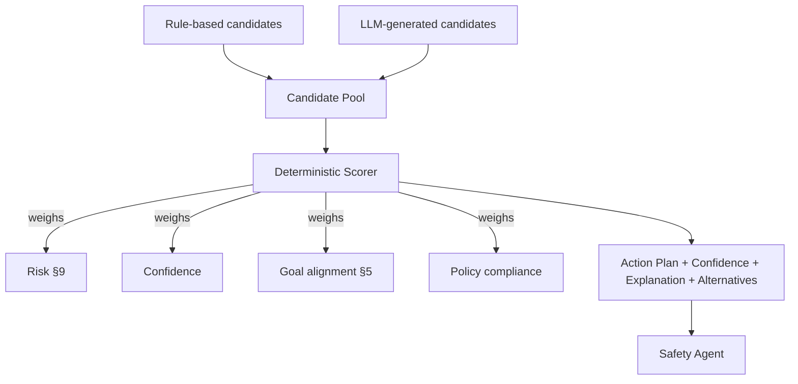
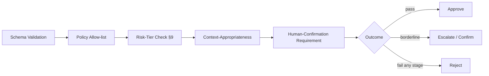
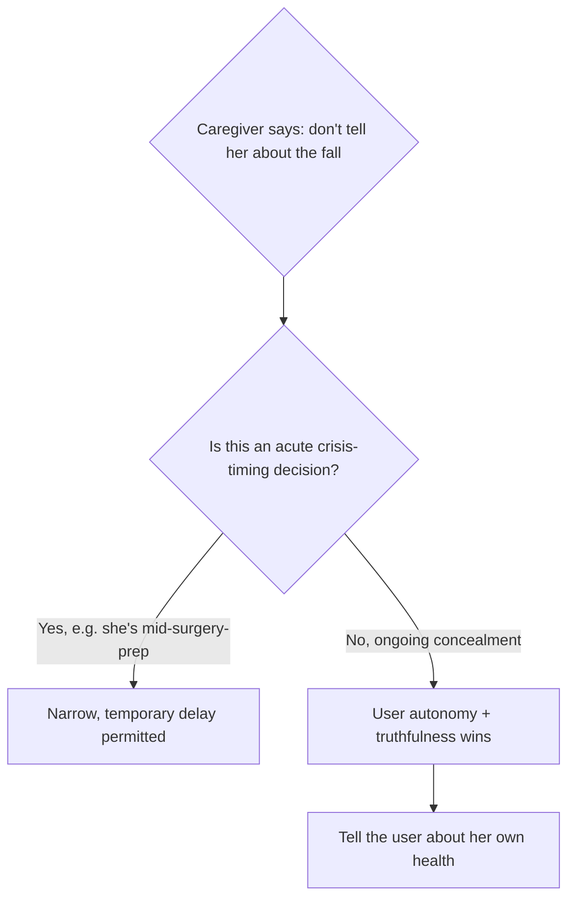

# LifeOS — Cognitive Operating System

*This document assumes [PHILOSOPHY.md](PHILOSOPHY.md), the PRD,
[ARCHITECTURE.md](ARCHITECTURE.md), and [MEMORY.md](MEMORY.md) as final and
immutable. It does not restate or modify any of them. Its job: define HOW
LifeOS thinks before it speaks or acts — not an LLM prompt, not
chain-of-thought, not chatbot reasoning.*

No production code appears below. The LLM is one reasoning component among
several, never the sole decision-maker.

**A note on integration, up front.** This document does not compete with
Architecture's existing pipeline and layers — it zooms into them. Three
explicit reconciliations, referenced throughout:

1. The Thinking Loop (§3) and its pipeline positioning is a **refinement**
   of Architecture §6's "AI Reasoning → Safety Validation" step, subdividing
   it into Cognitive reasoning + a Decision Engine scoring stage — not a
   second, competing pipeline.
2. The Cognitive Layers (§2) are a **functional cross-section** through
   Architecture's structural layers (§1) — mapped explicitly below, not a
   rival stack.
3. The Decision Engine (§7) lives **inside** Architecture §5's AI
   Orchestrator — this document specifies its scoring algorithm, not a new
   top-level component.

---

## Table of Contents

1. [Cognitive Philosophy](#1-cognitive-philosophy)
2. [Cognitive Layers](#2-cognitive-layers)
3. [Thinking Loop](#3-thinking-loop)
4. [Reasoning Types](#4-reasoning-types)
5. [Goal Management](#5-goal-management)
6. [Task Planning](#6-task-planning)
7. [Decision Engine](#7-decision-engine)
8. [Safety Validator](#8-safety-validator)
9. [Risk Assessment](#9-risk-assessment)
10. [Uncertainty Engine](#10-uncertainty-engine)
11. [Ethical Decision Making](#11-ethical-decision-making)
12. [Planning Horizon](#12-planning-horizon)
13. [Reflection Engine](#13-reflection-engine)
14. [Adaptive Intelligence](#14-adaptive-intelligence)
15. [Failure Recovery](#15-failure-recovery)
16. [Human Override](#16-human-override)
17. [Cognitive Architecture](#17-cognitive-architecture)
18. [Decision Traceability](#18-decision-traceability)
19. [Performance Targets](#19-performance-targets)
20. [Acceptance Criteria](#20-acceptance-criteria)

---

## 1. Cognitive Philosophy

Human cognition is not one thing to copy or reject wholesale — it is a
collection of strategies, some worth stealing and some worth deliberately
avoiding.

**What LifeOS should emulate:**
- **Bounded rationality / satisficing** — humans rarely find the globally
  optimal action; they find a *good enough* one fast, because waiting for
  certainty is itself costly. LifeOS's Decision Engine (§7) is built the
  same way: rank candidates, act on the best available, don't search
  forever for a theoretical optimum.
- **Hierarchical goal management** — humans hold multiple goals at once
  (stay safe, feel good, be social) and unconsciously prioritize among them.
  LifeOS's Goal Management (§5) makes this hierarchy explicit and
  hardcoded, rather than leaving it to be inferred per-turn.
- **Graceful degradation under damage** — a human who can't recall a name
  still functions; cognition fails a little at a time, not all at once.
  LifeOS's layered fallback ladders (§15) are a deliberate structural copy
  of this property.
- **Calibrated uncertainty** — a well-functioning human knows the
  difference between "I'm sure" and "I think so." LifeOS's Uncertainty
  Engine (§10) exists because this is worth having explicitly, not left
  implicit in a model's tone.

**What LifeOS must NOT emulate:**
- **Cognitive biases** (confirmation bias, anchoring, motivated reasoning) —
  these are systematic errors, not features. A system that anchors on its
  first hypothesis about a person's health and then discounts contradicting
  evidence would be actively dangerous here.
- **Fatigue-driven shortcuts** — humans get worse at reasoning when tired.
  LifeOS has no reason to degrade this way and must not simulate it.
- **Inconsistency** — a human's mood-of-the-day changes their patience and
  judgment. LifeOS's behavior should be stable and predictable turn to
  turn, per Philosophy's "trust over intelligence" and "presence over
  performance" principles.
- **Ego-protective rationalization** — humans resist admitting error to
  protect self-image. LifeOS has no self-image to protect and should
  admit uncertainty or mistakes immediately and plainly (§10, Philosophy §8).

The design stance, stated plainly: **LifeOS should be more consistent and
better calibrated than human cognition, while borrowing its good
architectural ideas** — hierarchy, satisficing, graceful degradation — and
rejecting its failure modes outright.

---

## 2. Cognitive Layers

Eleven functional layers, mapped explicitly onto Architecture §1's
structural layers so the two descriptions of the same system don't read as
contradictory.

| Cognitive layer | What it does | Maps to (Architecture) |
|---|---|---|
| Perception | Raw signal capture: audio, wake word, VAD | Conversation Layer, pipeline stages 1–3 |
| Understanding | Transcription + language ID + intent classification | Conversation Layer, pipeline stages 3–5 |
| Context | Assembling the situational frame (time, location, activity) | Memory §9 Context Engine |
| Memory | Retrieval of relevant durable facts | Memory Layer, MEMORY.md in full |
| **Reasoning** | Selecting and running the appropriate reasoning type(s) (§4) | AI Orchestration Layer — this document's core addition |
| Planning | Task decomposition and scheduling (§6) | Planning Layer + Planner Agent |
| **Decision** | Scoring/ranking candidate actions (§7) | Lives inside the AI Orchestrator (Architecture §5) |
| Safety Validation | Blocking approval gate | Safety Agent (Architecture §4), unchanged |
| Execution | Turning an approved Action into a device call | Automation Layer (Architecture §1) |
| Reflection | Post-action evaluation (§13) | New — extends Memory's Summarization/confidence update |
| Learning | Bounded parameter adaptation (§14) | New — extends Memory §7 Habit Learning + §15 Lifelong Learning |

The two layers marked **bold** (Reasoning, Decision) are this document's
actual new contribution. Everything else here was already named in
Architecture or Memory; this table exists so a reader moving between
documents never has to wonder whether two different architectures are being
described.

---

## 3. Thinking Loop

An OODA-loop derivative — Observe, Orient, Decide, Act, extended with
explicit Recall/Predict/Learn stages that a pure OODA loop leaves implicit.

| Stage | What happens | Existing component |
|---|---|---|
| Observe | Capture the raw utterance/signal | Perception layer (§2) |
| Orient | Classify what kind of situation this is | Understanding + Context layers |
| Recall | Retrieve relevant memory | Memory Retrieval (MEMORY.md §8) |
| Reason | Apply the relevant reasoning type(s) | §4, below |
| Plan | Decompose into a task graph if multi-step | §6 |
| **Predict** | Simulate the expected outcome before acting | **Genuinely new** — feeds the Decision Engine's confidence score (§7) |
| Validate | Safety gate | Safety Agent, unchanged |
| Execute | Perform the approved Action | Automation Layer |
| Observe Outcome | Did it work? Confirmed? Ignored? | Reflection Engine (§13) |
| Learn | Update bounded adaptation parameters | Adaptive Intelligence (§14) |

**Predict** is the one stage with no prior analogue in Architecture or
Memory: before an action is validated, the system generates a lightweight
expected-outcome estimate ("if I remind now, historical acceptance rate for
this person at this hour is ~80%") and attaches it as a confidence input to
the Decision Engine — not a full simulation, a cheap heuristic drawn from
Reflection Engine history (§13).

---

## 4. Reasoning Types

Twelve reasoning modes. None of them is "the AI" — each is selected by the
Reasoning layer per situation, and each carries an explicit trust boundary.

| Type | Used for | Trusted alone when | Never trusted alone when |
|---|---|---|---|
| Deductive | Certain rule application (medicine schedule logic) | The premises are confirmed facts | Premises themselves are uncertain |
| Inductive | Generalizing from repeated observation (habits) | Building a *candidate* pattern (Memory §7) | Asserting a habit as confirmed fact without independent confirmation |
| Abductive | Best-explanation guessing ("quiet 3 days → maybe low mood") | Generating a hypothesis for gentle inquiry | Triggering any action — must never bypass a confirming question |
| Probabilistic | Confidence-weighted reasoning under uncertainty | Ranking candidates in the Decision Engine | Overriding a deterministic safety rule |
| Rule-based | Deterministic safety/policy logic | Always — this is the highest-trust type in the system | Never distrusted; if a rule fires, it fires |
| Temporal | Schedule/sequence reasoning | Ordering tasks, reminder timing | Predicting exact real-world timing of external events (traffic, doctor availability) |
| Spatial | Location/room/home-layout reasoning | Torch/room-aware responses | Precise navigation without corroborating sensor data |
| Social | Relationship-appropriate tone and behavior | Choosing honorifics, adjusting warmth | Deciding who is authorized to receive sensitive information — that's Security's authorization model, not social inference |
| Health | Adherence/vitals trend reasoning | Producing a bounded Observation (Architecture §4) | **Never** trusted for diagnosis, under any framing |
| Ethical | Resolving value conflicts (§11) | Applying the fixed priority hierarchy | Inventing a new priority ordering at runtime — the hierarchy is fixed, not reasoned into existence per-turn |
| Goal-oriented | Means-end reasoning toward an active goal | Selecting the next step of an HTN plan (§6) | Overriding a higher-priority goal without going through §5's conflict rules |
| Counterfactual | Risk exploration ("what if she hadn't taken the medicine") | Internal risk-assessment reasoning (§9) | Ever spoken aloud to guilt or scare the user — Philosophy explicitly forbids pressure tactics |
| Causal | Explaining why an event happened (a fall correlated with a new medication) | Anomaly explanation surfaced to a doctor/caregiver as a *hypothesis* | Asserted as established medical causation — always framed as "worth mentioning to your doctor" |

---

## 5. Goal Management

Goals form a **fixed, hardcoded priority hierarchy** — not learned, not
re-derived per turn, for the same determinism reason Architecture rejects
AI-decided scheduling:

| Concept | Rule |
|---|---|
| Conflict resolution | Higher-priority goal wins, always, by the fixed hierarchy above |
| Interruption | The losing goal is **paused**, not cancelled — state is checkpointed |
| Resumption | Paused goals resume automatically once the higher-priority goal resolves, unless explicitly cancelled |
| Cancellation | Only user-initiated (or a permanent supersession, e.g., an appointment is rescheduled) |
| Completion | Detected via explicit confirmation event (`MedicineConfirmed`) or Reflection Engine inference — never silently assumed |

Example: "reach hospital" (Safety) preempts "watch prayer" (Convenience) —
the prayer-reminder goal pauses, and resumes automatically once the
emergency resolves, rather than being lost.

---

## 6. Task Planning

Different task shapes get different planning treatment — one planner does
not fit all of them.

| Task type | Strategy |
|---|---|
| Simple | Direct Action Generation — no real "planning" needed |
| Multi-step | **HTN decomposition** — a known template (medicine routine, appointment prep) broken into an ordered subtask tree with preconditions |
| Long-running | Checkpointed state persisted through Planning Layer, survives process restarts |
| Interrupted | Paused per §5's goal-pause mechanism, resumed from checkpoint, not restarted |
| Dependent | Subtask B's precondition includes "subtask A completed" — enforced by the HTN tree structure |
| Recurring | Handled entirely by the existing `ReminderType`/schedule abstraction (Architecture §9) |
| Collaborative | Involves a caregiver/doctor step — waits on an external confirmation event before the next subtask unlocks |
| Emergency | **Bypasses HTN entirely** — the compressed path from Architecture §12's Emergency flow, no decomposition depth |

**Recommendation: HTN for known task templates + a reactive behavior-tree
layer for interruption handling within a task**, explicitly rejecting full
GOAP (Goal-Oriented Action Planning) search. GOAP's open-ended action
sequencing is well-suited to games/robotics where creative solutions are
valuable; here, tasks are mostly well-understood templates (a medicine
routine has a known shape), and GOAP's emergent, harder-to-predict planning
trades away exactly the determinism this domain needs. Pure state machines
are too rigid for genuine multi-step decomposition; behavior trees alone
are excellent at reactive interruption but weak at expressing a structured
task hierarchy on their own — hence the hybrid.

---

## 7. Decision Engine

**The AI never executes directly** — this restates and specifies
Architecture's core principle. Decision-making is not "trust one model's
output." It is **candidate generation, then deterministic scoring**:

| Input | Output |
|---|---|
| Context, Memory, Goals, Safety allow-list, Permissions, Policies, Health state, Risk tier | Action Plan, Confidence score, Explanation, ranked Alternative Actions |

Rule-based and LLM-based candidate generators run **in parallel**, feeding
one pool; a deterministic scorer — not a second model call — ranks them.
This is deliberate: it means a bad LLM output is just one discarded
candidate among several, never the only option considered, and it means
the actual *choice* is always auditable code, never an opaque model
preference.

---

## 8. Safety Validator

A staged pipeline — every decision passes through all of it, in order.

| Example | Stage that catches it | Outcome |
|---|---|---|
| Wrong medicine (dose doesn't match schedule) | Schema Validation | Rejected — malformed against the known schedule |
| Late-night call | Context-Appropriateness | Escalated to confirmation ("It's 2am — still call her?") |
| Deleting memories | Human-Confirmation Requirement | Always requires explicit confirm, per Memory §11 |
| Emergency | Risk-Tier Check | Bypasses normal friction — Critical tier, pre-authorized |
| Financial request | Policy Allow-list | Rejected — not a permitted autonomous action category (Philosophy §8) |
| Medical advice | Policy Allow-list | Rejected — Health Agent's bounded output only, never free advice |
| Navigation | Context-Appropriateness | Confirmed if driving-context uncertainty is high |
| Sensitive information | Human-Confirmation Requirement | Requires the recipient be an authorized listener (Memory §9) |

---

## 9. Risk Assessment

| Tier | Example actions | Requirement |
|---|---|---|
| **Low** | Answering weather, opening YouTube | Auto-execute |
| **Medium** | Changing a non-critical reminder time, a call at an unusual hour | Proceed, log, notify |
| **High** | Changing medicine schedule, a financial-adjacent request | Explicit user confirmation required |
| **Critical** | Calling an ambulance, emergency escalation | Pre-authorized standing protocol (Architecture §12's Emergency flow) |

**Context modulates tier, not just action type.** "Call daughter" is Low
normally; the *same* action at 3am is elevated to Medium, requiring
confirmation — the Context Engine (Memory §9) feeds directly into this
tier assignment, not just the action's static category.

---

## 10. Uncertainty Engine

| Uncertainty source | Response strategy |
|---|---|
| Unknown fact | Ask a direct clarifying question |
| Conflicting memory | Surface the conflict, ask which is current (Memory §14) |
| Incomplete context | Proceed only if the action is low-risk and reversible; otherwise defer |
| Speech ambiguity | Ask for repetition/rephrasing, never guess silently |
| Medical uncertainty | **Always defer** — Health reasoning never resolves its own uncertainty by guessing |

The general shape: **low-stakes → clarify; reversible/medium-stakes →
proceed with a stated caveat; high-stakes/irreversible → defer or escalate,
never guess.** This directly operationalizes Memory's confidence model and
Philosophy's "never pretend to know" into an actual decision procedure.

---

## 11. Ethical Decision Making

A fixed priority ordering for conflicts, not a per-turn negotiation:

| Principle | Ordering |
|---|---|
| User autonomy | Generally outranks caregiver convenience |
| Truthfulness | Never traded away for a caregiver's request to conceal — no permanent concealment |
| Emergency override | Only in narrowly-defined, acute, life-threatening situations — never a blank check |
| Privacy | Defaults hold even against a caregiver request, absent the user's own consent |
| Consent | Required for any new sharing, always explicit |

---

## 12. Planning Horizon

| Horizon | Owner | Update frequency |
|---|---|---|
| Immediate (this turn) | Decision Engine (§7) | Every turn |
| Today | Planning Layer's existing scheduler | Daily |
| This Week | Planning Layer + Habit patterns | Weekly batch |
| This Month | Recurring cycles, appointment patterns | Monthly batch |
| Long-term / Life Goals | Memory's Life Timeline + Health Agent trend modeling | Low-frequency, batch-updated |

Longer horizons are deliberately **not** recomputed every turn — this is
both an efficiency choice and a stability one: a "life goals" assessment
that flapped turn-to-turn would itself be a trust failure.

---

## 13. Reflection Engine

After every important action: was it successful, did the user understand,
did they respond, was the reminder effective, should strategy change?

This feeds directly into Memory §7's Habit Learning confidence updates and
into reminder-cadence effectiveness — but **only within §14's bounded
adaptation ranges**, never as a silent, unbounded change to safety-critical
cadence. If nagging every 2 minutes isn't working for this person, the
Reflection Engine can propose escalating sooner — it cannot propose
stopping.

---

## 14. Adaptive Intelligence

Same argument as Memory §15: personalization lives in **data/parameters**,
never in model retraining.

| Parameter | Adaptable range | Hard floor |
|---|---|---|
| Reminder nag interval | 1–5 minutes | Never adapts to "stop reminding" |
| Confirmation frequency | Adjustable per person's demonstrated need | Safety-critical confirmations never removable |
| Speech speed / volume | Tunable continuously | — |
| Language | Switchable per context (Memory §5's context-scoped preference) | — |
| Communication style | Tone/phrasing adaptable | Never changes *whether* a safety-critical thing is said, only *how* |

---

## 15. Failure Recovery

| Failure | Degraded behavior |
|---|---|
| Reasoning failed (LLM/agent error) | Falls back to the deterministic rule-based reasoning type only — narrower, always available |
| Planner failed | Falls back to the simple/direct Action Generation path, skipping HTN decomposition |
| Memory conflict | Surfaced per Memory §14, never silently resolved |
| Wrong assumption | Corrected via the standard Memory §11 correction flow the moment it's caught |
| Network failure | Tier 2/3 fallback ladder (Architecture §11), safety-critical paths unaffected |
| Speech failure | Ask to repeat; button fallback after N failures |
| Health uncertainty | Always defers (§10) — never guesses |
| Emergency uncertainty | Errs toward escalation, not silence — a false alarm is recoverable, a missed emergency is not |

---

## 16. Human Override

Every override type is a **standing interrupt available at every stage of
the Thinking Loop (§3)**, not just at the end of a turn — this is an
architectural requirement on the loop's implementation, not a convenience
feature bolted on afterward.

| Override | Priority |
|---|---|
| User's own cancel/undo/ask-again | Generally highest, except acute emergency/doctor override |
| Caregiver override | Below user autonomy (§11), except acute safety situations |
| Doctor override | Can override in genuine medical-safety situations |
| Emergency override | Highest — bypasses normal friction entirely, per Architecture's Emergency flow |
| "Explain decision" | Always available, always answerable (§18) |

---

## 17. Cognitive Architecture

| Architecture | Strength | Weakness here | Verdict |
|---|---|---|---|
| Finite State Machines | Simple, predictable, easy to verify | Too rigid for open-ended multi-step reasoning | Used narrowly (Reminder State, Architecture §8) |
| Behavior Trees | Reactive, naturally interruptible | Weak at expressing structured task hierarchy alone | **Used** — for interruption/replanning within a task |
| GOAP | Flexible, creative action sequencing | Computationally open-ended, unpredictable — wrong fit for a safety-critical domain | **Rejected** |
| HTN Planning | Structured, template-able, predictable decomposition | Less flexible for truly novel tasks | **Used** — for known multi-step task templates |
| Rule Engines | Deterministic, fully auditable | No generalization, brittle to the unforeseen | **Used** — the non-negotiable safety substrate, always present |
| Knowledge Graph Reasoning | Strong at relational/entity queries | Weak at open-ended natural language | **Used** — for relationship/entity questions (reuses Memory's graph) |
| LLM Planning | Strong natural-language understanding, flexible candidate generation | No inherent safety guarantee, no determinism | **Used only as a candidate generator**, never the final arbiter |

**Recommendation: a hybrid.** Rule Engine as the always-present safety
substrate; HTN for known task templates; Behavior Trees for reactive
execution and interruption; Knowledge Graph reasoning for relational
queries; LLM strictly as a candidate generator and natural-language
interface feeding the Decision Engine (§7) — never the unchecked final
decision-maker. This directly extends Architecture §5's existing
"Orchestrator is deterministic, LLM is one of several tools" pattern into a
complete cognitive-architecture justification.

---

## 18. Decision Traceability

Every important decision logs: what happened, which reasoning type(s)
fired, what Turn Context was used, which memories were referenced
(provenance IDs, per Memory §11), which rules fired, which agents
participated, and what alternatives were rejected and why.

This is the direct technical extension of Architecture's "every action
must be verifiable" and Memory's "why did you remember this" — now
answering "why did you **decide** this."

---

## 19. Performance Targets

These integrate with, not duplicate, Architecture §14's existing latency
budget — the Decision layer fits inside the existing AI-reasoning window.

| Metric | Target |
|---|---|
| Decision latency | Within the existing <1.5s p50 AI reasoning budget (Architecture §14) — no separate budget stacked on top |
| Planning latency (HTN decomposition) | <300ms for known templates |
| Recovery latency (fallback engagement) | <100ms to detect and switch tier |
| Reflection latency | Async, non-blocking — never delays the current turn |
| Reasoning confidence threshold for auto-execute | ≥ the Low-risk tier's implicit bar (§9) |
| Decision accuracy | Tracked via Acceptance Criteria (§20) |

---

## 20. Acceptance Criteria

| Metric | Target |
|---|---|
| Planning quality | HTN plans complete without replanning in the large majority of routine cases |
| Decision quality | Chosen action matches what a human reviewer would independently choose, at a high rate |
| Safety | **Zero** critical-risk auto-executions without required confirmation — a hard zero, not a target to approach |
| False actions | As close to zero as possible — any false action is logged and reviewed via §18 |
| User trust | Direct periodic survey, echoing Philosophy §11 and Memory §18's trust metrics |
| Goal completion | Rate of goals reaching Completion (§5) vs. abandoned/timed-out |
| Reminder effectiveness | Confirmation rate within the expected window, tracked per Reflection Engine (§13) |
| Recovery success | Rate of failures (§15) that resolve to a working degraded mode vs. a dead end |
