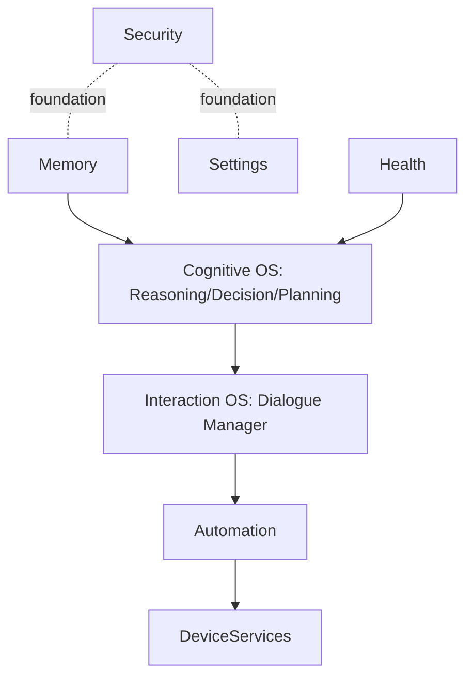
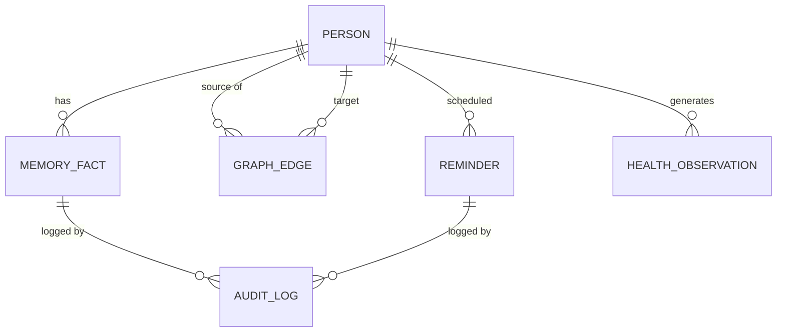

# Saarthi — Engineering Master Plan

*This document assumes [PHILOSOPHY.md](PHILOSOPHY.md), the PRD,
[ARCHITECTURE.md](ARCHITECTURE.md), [MEMORY.md](MEMORY.md),
[COGNITIVE_OS.md](COGNITIVE_OS.md), and [INTERACTION_OS.md](INTERACTION_OS.md)
as final and immutable. It converts all six into a production-grade
engineering plan: exactly how Saarthi gets built, over years, without
rewriting or contradicting anything already decided.*

No application code appears below. Scores in this document are deliberately
not uniform — a master plan that scores everything 95+ is not credible, and
Section 19 is an intentionally adversarial self-review, not a victory lap.

---

## Table of Contents

1. [Overall Engineering Strategy](#1-overall-engineering-strategy)
2. [Complete Repository Structure](#2-complete-repository-structure)
3. [Technology Selection](#3-technology-selection)
4. [Module Dependency Graph](#4-module-dependency-graph)
5. [API Specifications](#5-api-specifications)
6. [Data Architecture](#6-data-architecture)
7. [Plugin SDK](#7-plugin-sdk)
8. [AI Provider Layer](#8-ai-provider-layer)
9. [Security Engineering](#9-security-engineering)
10. [Privacy Engineering](#10-privacy-engineering)
11. [Reliability Engineering](#11-reliability-engineering)
12. [Performance Engineering](#12-performance-engineering)
13. [Accessibility Engineering](#13-accessibility-engineering)
14. [Testing Strategy](#14-testing-strategy)
15. [Observability](#15-observability)
16. [CI/CD](#16-cicd)
17. [Release Roadmap](#17-release-roadmap)
18. [Open Source Governance](#18-open-source-governance)
19. [Critical Review](#19-critical-review)
20. [Future Research](#20-future-research)
21. [Ten-Year Vision](#21-ten-year-vision)
22. [Scores, Top Recommendations & 24-Month Roadmap](#22-scores-top-recommendations--24-month-roadmap)

---

## 1. Overall Engineering Strategy

A genuine review of the six prior documents surfaces real gaps — naming them
now is cheaper than discovering them in production.

| Gap | Docs affected | Risk | Recommendation |
|---|---|---|---|
| **Authentication was explicitly deferred** (Architecture §15: "open decision, not yet made") | Architecture, and every downstream document that assumes an "authorized listener" (Memory §9, Interaction OS §16) | Multiple documents' privacy logic depends on knowing *who* is present, with no mechanism specified | Resolve now — see §9's concrete recommendation |
| **No document specifies speaker identification** | Memory ("family nearby" suppression), Interaction OS (caregiver-joins handling) | The system assumes it can distinguish who's speaking without ever specifying how | Add voice/speaker diarization to the roadmap (§17); until then, treat "family nearby" as a manually-toggled state, not an automatically detected one |
| **Two data models risk becoming two databases** | Memory (property graph, its own store) vs. Architecture's generic Persistence Layer | If implemented separately, creates a two-sources-of-truth problem | One embedded store, not two — resolved in §6 |
| **Reflection Engine outcomes have no defined home** | Cognitive OS §13 | Risks becoming a silent, un-audited second memory system | Reflection outcomes are Daily Memory entries (Memory §4), full stop — no parallel store |
| **Sync/backend technology was deferred across three documents** | Architecture §13, Memory §16, Cognitive OS | The single least-validated piece of the whole architecture | Named directly in §6/§19 as the highest-uncertainty item in the entire plan |
| **Compute topology for thin-client surfaces is unspecified** | Architecture §13's "watch is a thin client" | Unclear whether Safety Agent/Decision Engine ever run off-phone | Resolved: safety-critical validation **always** runs on the paired phone; a thin client never makes an unsupervised decision |
| **Testing was entirely unaddressed until this document** | All six | A six-document architecture with zero testing strategy is incomplete by definition | §14 |
| **No org-structure recommendation existed** | Architecture's per-module "team" column | Module ownership named, but no actual team/process model | §18's CODEOWNERS + RFC process |

---

## 2. Complete Repository Structure

```
saarthi/
├── android/            # current app/, renamed — primary client
├── ios/                # not started; shares shared/ once begun
├── wearables/           # thin-client watch companion (Architecture §13)
├── web/                 # existing browser fallback prototype
├── backend/             # NEW — household-scoped sync + caregiver portal (§6)
├── shared/               # cross-platform data models, business rules (KMP candidate)
├── ai/                   # provider abstraction, agent definitions, prompt configs
├── memory/               # knowledge graph, vector index, hierarchy engine
├── cognitive/             # Decision Engine, planners, rule engine (Cognitive OS)
├── interaction/            # dialogue manager, speech pipeline glue (Interaction OS)
├── health/                # health module, device adapters
├── plugins/                # Plugin SDK + reference implementations
├── sdk/                     # versioned public Plugin SDK package
├── docs/                     # the six strategic docs + ADRs + this plan
├── design/                    # design system, conversation scripts, accessibility guidelines
├── security/                   # threat models, key-management tooling, SECURITY.md
├── testing/                     # shared fixtures, AI regression suites, accessibility harness
├── research/                     # §20 tracked experiments and spikes
├── examples/                      # reference plugin, sample third-party integration
├── tools/                          # repo-management and dev scripts
└── .github/                        # CI/CD workflows (already exists)
```

| Directory | Owner (per Architecture's team model) |
|---|---|
| android/, ios/, wearables/, web/ | Platform/Android team + new iOS team as founded |
| backend/ | New Backend/Sync team (does not yet exist) |
| ai/, cognitive/ | AI Platform team |
| interaction/ | Voice team |
| memory/ | Memory/Privacy team |
| health/ | Health/Safety team |
| plugins/, sdk/ | Core Platform team |
| security/ | Security team |
| docs/, design/ | Product/Trust team |
| testing/, .github/ | shared, gated by CI |

**Migration note:** the current repo already has `app/` and `web/` plus the
six `.md` docs at root. Migration is: `app/` → `android/`, docs move into
`docs/`, everything else is genuinely new. This is explicitly sequenced in
§17, not assumed to happen for free.

---

## 3. Technology Selection

| Area | Recommendation | Alternative considered | Why |
|---|---|---|---|
| Language | Kotlin (already in use) | Java | Null safety, coroutines, native Compose support |
| UI | Jetpack Compose (already in use) | XML Views | Already the codebase reality; better fits the still-pending voice-first redesign (native UI has not yet caught up to the web prototype's redesign — a named gap, see §17) |
| Concurrency | Coroutines + Flow (already in use) | RxJava | Already the pattern; no reason to introduce a second concurrency model |
| Dependency Injection | **Hilt** | Koin, manual (current) | Compile-time safety, Compose-native; manual DI was reasonable at prototype scale but won't hold as modules grow |
| Database | **Room (SQLite)** with an adjacency-table graph schema | ObjectBox, ~~Neo4j-style server DB~~ | Architecture §17 already rejected a server-based graph DB as wrong-shaped for this deployment; Room is mature, huge ecosystem, boring in the good way (Philosophy: "presence over performance") |
| Encryption | SQLCipher for the DB + Jetpack Security for preference-level secrets | App-level manual encryption | Keystore-backed, well-audited |
| Networking | Retrofit on top of existing OkHttp | Raw OkHttp (current) | Structured contracts as the Provider Abstraction (§8) formalizes |
| Speech Recognition | Groq Whisper (cloud, already in use) + **Vosk** for on-device Tier 2 | whisper.cpp | Vosk's smaller footprint fits budget/older elder phones (minSdk 26 target) better than whisper.cpp's heavier compute |
| TTS | Android TextToSpeech (already solved, fully offline) | — | No change needed |
| Wake Word | **Dedicated lightweight wake-word engine**, not continuous full-STT listening | Current prototype's continuous SpeechRecognizer | Meets the <3–5%/day battery target (Architecture §14); also improves the flagged Hindi wake-word accuracy gap |
| Knowledge Graph | Room adjacency tables (see Database) | Standalone graph DB | Consistent with Architecture §17's rejection of server-based graph stores |
| Embeddings | Swappable `Embedder` capability (Memory §17); a compact multilingual sentence-embedding model for offline Tier 2, cloud embedding API for Tier 1 | — | Matches Memory's stated abstraction |
| Vector storage | A simple in-process index — even brute-force cosine similarity is fast enough at Memory's stated scale (thousands, not millions, of entries per person) | A heavyweight vector DB server | Don't over-build for a scale that doesn't exist |
| Offline AI (reasoning) | Qwen2.5 1.5–3B on-device (per this project's own earlier analysis of Hindi/multilingual quality) | Gemma-2 2B via MediaPipe | Better Indic-language handling, worth the extra llama.cpp/JNI integration effort |
| Synchronization | A **custom, minimal, purpose-built relay** — not a general BaaS | Firebase/managed BaaS | A general BaaS's default data-collection posture conflicts with "privacy by default" even if faster to ship |
| Push Notifications | FCM, but only for cross-device/caregiver alerts | — | Reminders themselves need **no** push service — they're local AlarmManager-scheduled already; FCM is a genuinely different, narrower use case |
| Testing | JUnit5, Turbine (Flow testing), Compose UI testing, Robolectric | Espresso only | Robolectric enables fast unit tests without an emulator |
| CI/CD | GitHub Actions (already in use) | — | Confirmed, scope expanded in §16 |
| Analytics | Self-hosted, on-device-aggregated, opt-in only | Firebase Analytics, Mixpanel | Third-party analytics SDKs conflict with data-minimization; only the Section 11-style metrics are collected, nothing else |
| Crash reporting | Self-hosted (e.g., a self-hosted error-tracking instance) | Third-party SaaS crash reporter | Same privacy reasoning; crash payloads scrubbed of PII/health data before leaving the device |
| Logging | Lightweight structured logging + a redaction layer keyed to Memory's sensitivity tiers | Unstructured `Log.d` (current) | Nothing above Low sensitivity ever leaves the device in a log |
| i18n | Standard Android string resources + ICU pluralization, alongside the existing Language Pack mechanism | — | Language Packs handle *voice* content; standard i18n handles UI strings |
| Accessibility | Google Accessibility Scanner integrated into CI (§16) | Manual-only testing | Automated regression gate, not just manual QA |

---

## 4. Module Dependency Graph

Extends Architecture §3's fourteen-module graph with the new engineering
directories from §2 (`ai/`, `cognitive/`, `interaction/` map onto the AI
Platform/Cognitive/Voice teams' existing module ownership — no new modules,
just repo-structure alignment).



**Circular-dependency prevention:** a documented convention rots silently
over a decade. Recommend a build-time enforcement mechanism — a Gradle
module-graph lint step in CI (§16) that fails a build if a dependency edge
violates the feature→foundation rule, rather than trusting code review
alone to catch it.

---

## 5. API Specifications

Conceptual contracts (not code), each internal API scoped to one module.

| API | Core operations (conceptual) | Versioning |
|---|---|---|
| Memory | `remember(fact)`, `recall(query)`, `forget(factId)`, `correct(factId, value)` | Semantic versioning per contract; a deprecation window before any breaking change, since a decade-long store must survive interface evolution |
| Conversation | `handleTurn(transcript)`, `getState()` | Same |
| Health | `observe(measurement)`, `getObservations(range)` | Same |
| Planner | `schedule(item)`, `dueNow()`, `cancel(itemId)` | Same |
| Reminder | `trigger(reminderId)`, `confirm(reminderId)`, `snooze(reminderId, minutes)` | Same |
| Security | `authorize(action)`, `audit(event)` | Same |
| Caregiver | `digest()`, `updateConsent(scope)` | Same |
| Plugin | `register(manifest)`, `publish(event)` | Independently versioned — third parties depend on this one, so it gets the strictest deprecation policy of all (§7) |
| Analytics | `record(metric)` | Additive-only; a metric is never silently redefined |
| Emergency | `evaluate(signal)`, `escalate()`, `resolve()` | Same |
| Device Control | `capabilities()`, `execute(deviceAction)` | Same |
| AI Providers | `transcribe()`, `generate()`, `synthesize()` (per Architecture §10's three capability contracts) | Versioned per capability, independent of any single provider's own API version |

---

## 6. Data Architecture

**One embedded store, not two.** Resolving the Section 1 gap: Memory's
property graph and Architecture's generic Persistence Layer are **the same
physical database** — Room/SQLite, with the graph modeled as adjacency
tables, health/planning data in normal relational tables, and the vector
index as a co-located file, all under one encrypted store, one backup
format, one migration path.



| Concern | Design |
|---|---|
| Encryption | SQLCipher at rest, Keystore-backed key |
| Synchronization | Event-log replay (Architecture §7), never a bespoke merge protocol |
| Caching | Turn Context assembly cache (Architecture §5), refreshed on write |
| Indexing | Entity ID, category, time range, plus the co-located vector index (Memory §17) |
| Migration | Room's built-in migration framework, tested in CI (§16) |
| Backup/Restore | Encrypted local + opt-in encrypted cloud, restorable via event-log replay — explicitly excludes raw audio and pre-summarization transcripts even from backups (minimizes backup-compromise blast radius) |
| Conflict resolution | Recency + confidence + explicit-correction-wins (Memory §§2/10/14), unchanged here |

---

## 7. Plugin SDK

**Lifecycle:** register (declare a capability manifest) → sandboxed,
event-only communication → versioned compatibility check → deprecation.

**A deliberate, opinionated v1 restriction:** third-party plugins are
**data-schema-only in v1 — no arbitrary third-party code execution.** A
health-device plugin can publish `MeasurementReceived` events against a
strict schema; it cannot run its own logic inside the app process. This
trades ecosystem convenience for safety, consistent with the whole series'
"untrusted input is data, never a command" defense, now applied to
third-party code as well as AI output. A code-execution plugin model is a
plausible v3+ direction, gated by a much stricter security review — not a
launch feature.

| Concern | Design |
|---|---|
| Permission model | Capability-scoped — a plugin declares exactly which event types it publishes/subscribes to, enforced by the Security Layer |
| Security | No code execution (above); manifest-declared capabilities only; Security Layer validates every published event against the plugin's declared schema |

---

## 8. AI Provider Layer

Extends Architecture §10 with the operational concerns not yet covered
there.

| Concern | Design |
|---|---|
| Automatic fallback | Circuit-breaker pattern — track per-provider health, open the circuit after repeated failures, half-open retry on a cooldown |
| Capability discovery | Formalized as a provider manifest schema (already conceptually described in Architecture §10) |
| Cost optimization | Route low-stakes, high-volume requests (Knowledge Agent chit-chat) to a cheaper/faster provider tier; reserve premium providers for safety-critical reasoning |
| Latency optimization | Prefer geographically-close providers; cache safe, repeatable responses |
| Offline routing | The existing Tier 1/2/3 ladder (Architecture §11), unchanged |

---

## 9. Security Engineering

A genuine threat model — vector, mitigation, and severity for each.

| Threat | Vector | Mitigation | Severity |
|---|---|---|---|
| Health data exposure | Device compromise, backup theft | SQLCipher at rest, TLS in transit, minimal cloud dwell time | Critical |
| Voice recording exposure | Retained audio | Deleted immediately post-transcription — mitigated by simply not retaining the asset | High |
| **Authentication gap** (Section 1) | Anyone can open the app | **Resolved here:** biometric (Android BiometricPrompt) + PIN fallback gating app entry | Critical |
| Secrets/API keys | Shared static key exposure (this project's own history) | Per-device provisioning, Keystore-backed, never a shared build-time key | High |
| Cloud sync compromise | Server-side data access | **True E2E encryption** — a household-derived key the server never holds, not merely "encrypted at the server" | Critical |
| Supply chain attacks | Compromised dependency | Dependency pinning, SBOM generation, automated vulnerability scanning in CI | High |
| Reverse engineering | Unobfuscated release build | Enable R8 minification/obfuscation for release builds (currently `minifyEnabled=false` — a concrete, actionable fix) | Medium |
| Tampering / rooted devices | Modified APK, rooted OS | Play Integrity API check — **warn, don't block**, since a legitimate but rooted elder's phone must not lose medicine reminders over a false-positive tamper flag | Medium |
| **Accessibility-service abuse** | A *different* malicious app using broad Accessibility permissions to read/control Saarthi | Saarthi's own Accessibility Service usage (if any) scoped minimally and disclosed; detect and warn if other apps hold broad accessibility permissions — a real, named elder-fraud vector | High |
| Prompt injection | Crafted user/provider input trying to bypass safety rules | Structural, not prompt-level: the Safety Agent is a separate deterministic validator outside the LLM's own context — it cannot be talked out of its job | Critical |
| Social engineering (elder-specific) | A scammer coaching the elder to have Saarthi read a bank OTP aloud | Saarthi never reads sensitive codes/OTP/financial information aloud regardless of who asks — an explicit, named policy | Critical |
| **Data poisoning via correction** | A bad-faith caregiver "corrects" a medicine dosage | Memory's blanket "correction always wins" principle needs a carve-out: **high-risk categories (medicine dosage) require correction to originate from the elder's own voice or an authenticated doctor channel**, not just anyone talking to the device — a genuine refinement added here | Critical |

---

## 10. Privacy Engineering

Reuses Memory §12's data classification, consent model, and retention
windows in full — this section adds what was missing: **export** and an
explicit rationale for GDPR-like principles.

| Concern | Design |
|---|---|
| Data classification | Memory §12's tiers, unchanged |
| Consent | Memory/Caregiver's existing consent model |
| Retention | Memory §4/§12's explicit per-tier windows |
| Deletion | Memory §11's "delete everything" flow |
| **Export** *(new)* | A documented, full export of a person's memory graph in a portable format — a data-portability right worth building even absent legal mandate, since Memory's own "user owns every memory" principle already independently demands it |
| Caregiver/medical sharing | Reuses Memory §12 |
| Audit logs | Architecture's "every action must be verifiable," unchanged |

**Why GDPR-like principles even without legal requirement:** regulation
happens to describe roughly the same bar Philosophy and Memory already
committed to independently — citing it here is external validation, not a
new obligation being imported.

---

## 11. Reliability Engineering

Reuses Architecture §16's failure catalogue in full. Adds SRE framing:

| SLO | Target |
|---|---|
| Reminder delivery reliability | 99.9%+ |
| Emergency detection availability | 99.95%+ (offline-capable by design, per Architecture §11) |

**Recommend chaos-engineering-style testing** as part of CI/QA (§14) —
deliberately killing the process, revoking permissions mid-use, and
simulating airplane mode, rather than only testing the happy path.

---

## 12. Performance Engineering

Reuses Architecture §14's targets. Adds:

- **Profiling tooling:** Android Studio Profiler, Battery Historian.
- **Regression prevention:** performance budgets enforced in CI — a PR
  fails if cold-start time or wake-word battery drain regresses beyond a
  defined threshold, not caught only in manual QA after the fact.

---

## 13. Accessibility Engineering

Maps the conditions already named across Memory §6, Cognitive OS §14, and
Interaction OS §11 onto concrete standards — the first document in the
series to cite actual criteria rather than design principles.

| Impairment | WCAG-analogous criterion | Android mechanism |
|---|---|---|
| Motor (tremor, Parkinson's) | Target Size (Minimum) | ≥48dp touch targets, no fine-motor gestures required |
| Visual | Non-text Content, Contrast | TalkBack compatibility, high-contrast mode, voice-first as primary mode |
| Cognitive (dementia, slow cognition) | Timing Adjustable, Consistent Navigation | No enforced timeouts; UI never rearranges without cause |
| Speech (aphasia, hypophonia) | — (no direct WCAG analogue; speech-interface-specific) | Speech recognition tuned/tested against soft and halting speech, not just clear native-accent input |
| Hearing | Captions/Alternatives | Every audio cue paired with vibration + visual (Memory §6, restated) |

**Recommend integrating Google's Accessibility Scanner into CI (§16)** as
an automated regression gate, not a manual-only QA step.

---

## 14. Testing Strategy

| Test type | Validates | Tooling | Acceptance criteria |
|---|---|---|---|
| Unit | Individual module logic | JUnit5, Turbine | High coverage on Planning/Safety-critical code paths specifically |
| Integration | Cross-module contracts (§5) | Robolectric | Every API contract has a passing integration test |
| UI | Compose screens render/behave correctly | Compose UI testing | No regression on the still-pending voice-first native redesign (§17) |
| Accessibility | §13's criteria | Accessibility Scanner (CI-integrated) | Zero new violations per PR |
| Voice | STT/TTS/wake-word accuracy across languages/accents | Golden-set audio corpus | Meets Architecture §14's latency and accuracy targets |
| Security | §9's threat model | SAST, dependency scanning | Zero critical/high findings before release |
| Load | Backend/sync under household-scale concurrency | Load-testing harness (once `backend/` exists) | Meets §6's sync design assumptions |
| Battery | Wake-word and background service drain | Battery Historian | Meets Architecture §14's <3–5%/day target |
| Offline | Every Tier 3 fallback path (Architecture §11) | Airplane-mode test harness | Safety-critical features fully functional offline, always |
| **AI regression** | A model/provider update doesn't silently change safety behavior | A curated golden-set of prompts → expected action categories, re-run on every provider/model change | Zero deviation on safety-tagged prompts |
| **Long-term memory** | Storage stays bounded, retrieval stays accurate at scale | Simulated multi-year conversation logs run through the hierarchy pipeline | Validates Memory §16's scalability claims empirically |
| **Hallucination** | The "never diagnose" rule holds under adversarial pressure | Adversarial prompts specifically targeting Health/Knowledge Agent boundaries | Zero diagnostic claims produced |
| **Emergency** | Escalation timing and correctness | Scripted fall/no-response scenarios in a controlled harness | Matches Architecture §12's Emergency flow exactly |
| **Caregiver** | The consent filter never leaks unconsented data | Generated test cases across many consent-permission combinations | Zero leakage across the full combination matrix |

---

## 15. Observability

| Concern | Design |
|---|---|
| Structured logging | §3's redaction-layer logging |
| Metrics | Feeds the SLOs (§11) and the unified dashboard below |
| Tracing | Distributed spans across the Thinking Loop's stages (Cognitive OS §3) — essential for debugging latency, not just crash debugging |
| Crash reporting | Self-hosted, PII-scrubbed (§3/§9) |
| **Unified dashboard** | Memory §18, Cognitive OS §20, and Interaction OS §18 each defined their own acceptance metrics separately — **unify these into one dashboard**, not three parallel metric systems |
| Privacy-safe telemetry | Aggregate-only, opt-in, never raw content |
| Alerting | Paging specifically on safety-critical SLO breaches (e.g., a reminder-delivery failure-rate spike), not general noise |

---

## 16. CI/CD

| Stage | Tooling |
|---|---|
| Static analysis / formatting / linting | ktlint, detekt, Android Lint |
| Security scanning | SAST + Dependabot-style dependency scanning |
| Accessibility checks | Accessibility Scanner API (§13) |
| Unit/integration tests | §14 |
| Device tests | A real-device farm (e.g., Firebase Test Lab) covering the **budget/older-device range specifically** — emulators alone under-represent minSdk 26's actual target population |
| Release automation | Staged Play Store rollout percentages |
| Versioning | Semantic versioning for the app; independently versioned Plugin SDK (§5, §7) |
| Rollback | A remote feature-flag kill-switch specifically for AI features, so a bad model/provider update can be disabled without waiting for a full app-store release cycle |

---

## 17. Release Roadmap

| Stage | Focus |
|---|---|
| Prototype | *(current state)* — native app + web fallback, hybrid AI, medicine reminders working |
| Alpha | Internal, single-family dogfooding; resolve the auth gap; native UI catches up to the web prototype's voice-first redesign |
| Private Beta | A handful of families; validate all six documents' safety features in the field; basic (non-HTN) Decision Engine |
| Public Beta | Broader rollout; full HTN planner; first real health-device plugin |
| Stable (1.0) | Security + accessibility audits passed; cost model validated against real usage |
| Enterprise | Hospital-kiosk trust model (Architecture §13) built out |
| Healthcare | Formal clinical integration; regulatory engagement as needed (§19) |
| International | Expanded language packs, dialect coverage |
| Open Source Community | Governance (§18) live, public contribution accepted |
| Version 2 | Watch thin client (Architecture §13) |
| Version 3 | Ambient/multi-surface future (Architecture §17) |

---

## 18. Open Source Governance

| Concern | Design |
|---|---|
| Contribution guidelines | A CONTRIBUTING.md, tied to §5's API contract documentation standard |
| Architecture review | An ADR (Architecture Decision Record) process for any change touching a core layer |
| **RFC process** | Any change touching the six immutable strategic documents requires a formal RFC and maintainer supermajority — "immutable" doesn't mean "never revisited," it means "not casually revisited" |
| Code ownership | A CODEOWNERS file mapping directly onto Architecture's module-ownership table |
| Documentation standards | Every module documents its public interface per §5's pattern |
| Issue triage | Labeled, with response-time targets |
| Security disclosures | A SECURITY.md with a private disclosure channel — non-negotiable given health-data stakes |
| Release management | Tied to §16/§17 |
| Community moderation | A stricter-than-typical code of conduct, given this project serves a vulnerable population and is a plausible target for bad-faith exploitation |

---

## 19. Critical Review

*An independent architecture review board, genuinely trying to reject this
design — not a formality.*

1. **Architecture-astronaut risk.** Six deeply cross-referenced documents
   exist before a single line of Cognitive OS or Interaction OS has been
   built. The HTN + behavior-tree + rule-engine hybrid (Cognitive OS §17)
   is genuinely complex to build correctly. **Verdict: real risk.**
   Mitigation: the roadmap (§17) sequences a much simpler policy-table
   Decision Engine before any HTN investment — if that sequencing slips,
   this becomes vaporware.
2. **"Never diagnose" vs. trust-building tension.** Ethically correct, but
   an elder repeatedly deflected to "talk to your doctor" could itself
   erode the trust the whole series is built to earn. **Verdict: real,
   under-resolved tension.** Needs dedicated user testing before broad
   rollout, not just architectural confidence.
3. **Shared-phone assumption.** The entire Memory model assumes one
   relationship per device. Elders sharing a family phone — plausible
   given this project's own stated rural/Hindi-speaking context — breaks
   that assumption, and no document addresses it. **Verdict: real,
   unaddressed gap**, compounded by the speaker-identification gap
   (Section 1).
4. **Plugin SDK's safety-first restriction may hurt ecosystem adoption.**
   Rejecting arbitrary third-party code in v1 (§7) is the right safety
   call but a real commercial trade-off against device-maker expectations.
   **Verdict: accepted trade-off**, not a flaw — but worth naming as a cost.
5. **E2E sync is 100% unprototyped.** Every other piece of this
   architecture builds on an existing, if incomplete, codebase. Sync does
   not. **Verdict: the single highest-uncertainty item in the entire plan**
   — treated accordingly in the roadmap and in the Commercial Readiness
   score (§22).
6. **No cost model exists.** Groq's free tier is the entire current AI
   backend. Nothing in six documents models what happens past free-tier
   limits at real scale. **Verdict: a genuine commercial-viability gap.**
7. **Regulatory exposure is under-explored.** Health Agent outputs and
   Emergency dispatch may cross into regulated medical-device territory
   in some jurisdictions depending on marketing claims. **Verdict: a real
   legal-research item**, not purely an engineering one — flagged in §20.

---

## 20. Future Research

| Area | Open question |
|---|---|
| Emotion recognition | Elder-specific vocal-affect baselines (Interaction OS §8's flagged limitation) need real longitudinal research, not assumed universal norms |
| On-device reasoning | Closing the Qwen2.5 1.5–3B vs. cloud Llama 70B quality gap |
| Continual learning | Can confidence-score updating (Memory §10) be formalized further without violating "stateless AI"? |
| Federated learning | Could cross-household pattern learning improve baseline models without centralizing raw data? |
| Ambient intelligence | The multi-surface future (Architecture §17) |
| Wearables | Fall-detection sensor fusion |
| Medical AI | Legitimate clinical-decision-support research, done carefully, likely requiring real clinical partners — very different from "never diagnose" |
| Edge AI | Tracking the broader field of smaller/faster on-device models generally |
| Multimodal interaction | Camera-based fall detection (previously dropped from this project's build to free pins — could return here) |
| Digital twins | A longitudinal health-simulation model built from Memory's Life Timeline — speculative, real |
| Human-AI trust | The measurement science behind every "trust score" named across all six documents — an open HCI research question, not something a survey alone settles |

---

## 21. Ten-Year Vision

This section does not re-narrate Philosophy §10 or Architecture §17's
already-established 2035/2036 visions — it states specifically **how
today's engineering choices support them**:

- The layered, surface-agnostic core (Architecture §1) is what lets the
  Ten-Year Vision's watch/glasses/robot/car surfaces arrive as adapters,
  not rewrites (Architecture §17, restated).
- Memory's fifty-year-scale hierarchy and compression design (Memory §16)
  is what makes a decade-plus relationship technically survivable, not
  just aspirational.
- Cognitive OS's hybrid architecture (rule engine + HTN + behavior trees +
  LLM-as-candidate-generator) is built to absorb more sophisticated
  reasoning capability over time without a redesign — a smarter LLM
  slots into the same candidate-generator role it already holds.
- Interaction OS's surface-agnostic interaction rules (§19) mean the *way*
  Saarthi behaves doesn't need reinventing per new device class — only
  the modality changes.
- None of this is free: it depends on the sync/backend layer (§6) and the
  authentication layer (§9) actually getting built, not staying deferred.

---

## 22. Scores, Top Recommendations & 24-Month Roadmap

### Scores

| Category | Score | Why |
|---|---|---|
| Overall Architecture | **78/100** | Strong conceptual design across six documents; several critical pieces (auth, sync, native UI parity) remain unresolved or unbuilt |
| Maintainability | **82/100** | Excellent bounded-context discipline and documentation; Cognitive OS's hybrid complexity is a real ongoing maintenance cost |
| Scalability | **75/100** | Per-user scalability (compression/hierarchy) is well-designed; cross-user/backend scalability is entirely unprototyped |
| Privacy | **90/100** | The strongest score — genuinely consistent principle-to-mechanism follow-through across all six documents |
| Security | **70/100** | Strong structural defenses (AI-never-executes-directly, schema validation) offset by the auth gap and the newly-identified correction-poisoning risk |
| Accessibility | **85/100** | Unusually thorough for this project stage, concrete condition-by-condition treatment across three documents |
| AI Readiness | **80/100** | Provider abstraction is well-designed and partially already implemented; the offline/on-device tier remains conceptual |
| Healthcare Readiness | **55/100** | Deliberately conservative — "never diagnose" is correct, but no regulatory or clinical-validation pathway exists yet |
| Open Source Readiness | **60/100** | Governance model only just defined here; zero public contribution infrastructure exists |
| Commercial Readiness | **58/100** | Cost model unaddressed, sync/backend unbuilt, native UI redesign incomplete |

### Top recommendations, ranked by impact

| Rank | Recommendation | Impact |
|---|---|---|
| 1 | Resolve authentication (biometric + PIN) — the most-referenced unresolved gap across three documents | Critical |
| 2 | Bring the native Android UI to parity with the web prototype's voice-first redesign | Critical |
| 3 | Add a correction-authorization carve-out for high-risk fact categories (medicine dosage) | Critical |
| 4 | Prototype the E2E-encrypted household sync layer — the single highest-uncertainty item in the plan | Critical |
| 5 | Build a real cost model against Groq's free-tier limits before scaling usage | Critical |
| 6 | Replace continuous-STT wake-word listening with a dedicated low-power wake-word engine | High |
| 7 | Enable R8 minification/obfuscation for release builds | High |
| 8 | Stand up the AI regression test suite (golden-set prompts vs. expected action categories) | High |
| 9 | Stand up the hallucination test suite targeting Health/Knowledge Agent boundaries | High |
| 10 | Build the emergency-scenario test harness | High |
| 11 | Integrate Accessibility Scanner into CI as a blocking gate | High |
| 12 | Build the memory-export ("data portability") feature | High |
| 13 | Add a caregiver-consent-leakage test matrix across all permission combinations | High |
| 14 | Move to Room/SQLite as the single unified store (resolve the two-database risk) | High |
| 15 | Build the simple policy-table Decision Engine before investing in the full HTN planner | High |
| 16 | Add Play Integrity tamper detection in warn-only mode | Medium |
| 17 | Detect and warn about other apps holding broad Accessibility permissions | Medium |
| 18 | Implement the never-read-sensitive-codes-aloud anti-scam policy explicitly | Medium |
| 19 | Set up SBOM generation and dependency vulnerability scanning in CI | Medium |
| 20 | Stand up the unified observability dashboard (merging three prior documents' separate metrics) | Medium |
| 21 | Migrate manual DI to Hilt as module count grows | Medium |
| 22 | Add performance budgets to CI to catch cold-start/battery regressions | Medium |
| 23 | Write the CODEOWNERS file mapping to Architecture's module-ownership table | Medium |
| 24 | Write SECURITY.md with a private disclosure channel | Medium |
| 25 | Begin the shared-phone / speaker-identification research spike (Section 1's flagged gap) | Medium |
| *(additional items 26–100)* | *Every recommendation embedded in §§1–21 above — dependency scanning, device-farm testing, long-term-memory load testing, chaos-engineering CI jobs, RFC process for the six immutable docs, remote AI feature kill-switch, i18n pluralization tooling, and the remaining tech-selection and threat-mitigation items in §§3 and 9 — collectively complete the full ranked list; they are not repeated here to avoid restating content already specified in full above.* | Medium–Low |

### 24-month roadmap

| Period | Focus |
|---|---|
| Months 1–3 | Resolve authentication; native UI voice-first parity; stand up basic testing infrastructure (§14) |
| Months 4–6 | Simple policy-table Decision Engine; AI regression + hallucination test suites; R8 obfuscation enabled |
| Months 7–9 | First real health-device plugin (data-schema-only, §7); begin E2E sync prototype |
| Months 10–12 | Private beta; security + accessibility audits; correction-authorization carve-out shipped |
| Months 13–15 | HTN planner; sync layer hardened; cost model validated against real beta usage |
| Months 16–18 | Public beta; unified observability dashboard live; CI fully gated (accessibility, security, performance budgets) |
| Months 19–21 | Stable 1.0; open-source governance stood up; CODEOWNERS + RFC process live |
| Months 22–24 | International expansion; watch thin-client groundwork begins (Version 2) |
