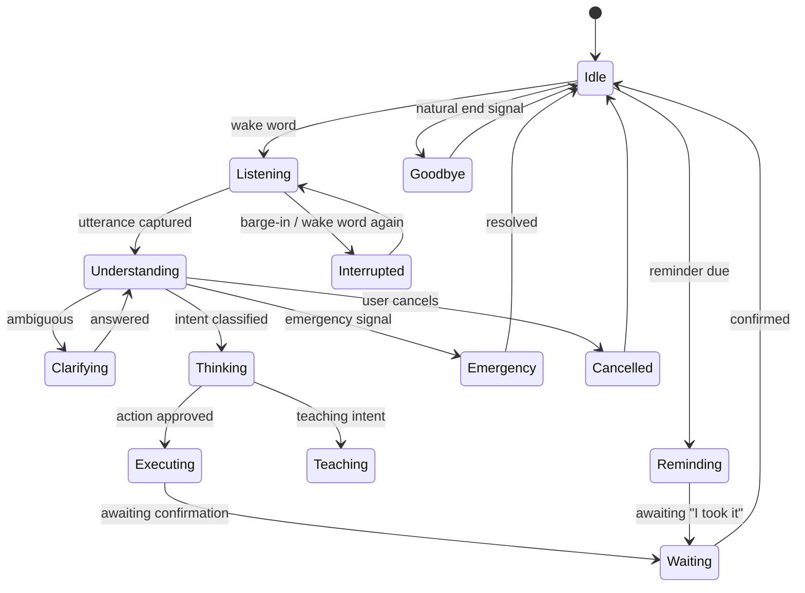
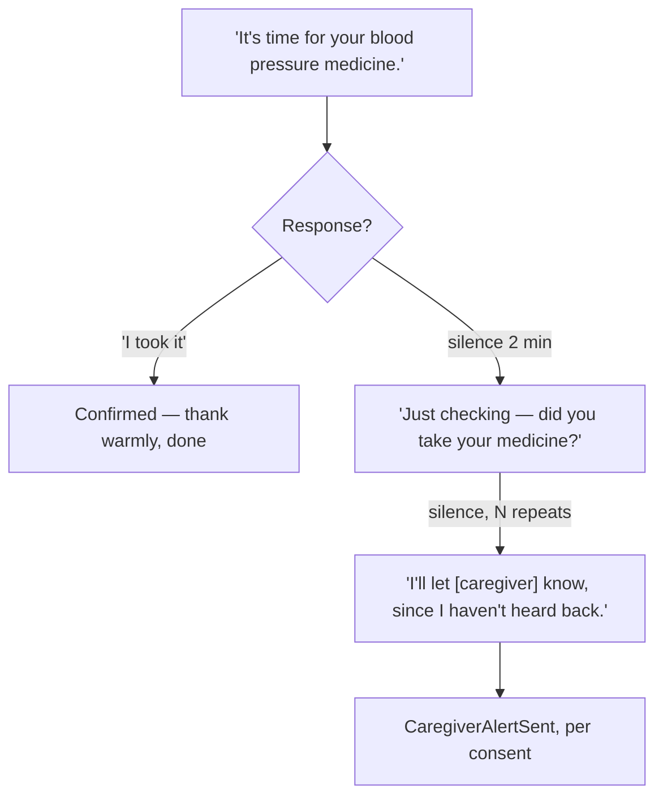

# LifeOS — Interaction Operating System

*This document assumes [PHILOSOPHY.md](PHILOSOPHY.md), the PRD,
[ARCHITECTURE.md](ARCHITECTURE.md), [MEMORY.md](MEMORY.md), and
[COGNITIVE_OS.md](COGNITIVE_OS.md) as final and immutable. It does not
restate or modify any of them. Its job: the complete human-AI interaction
layer — not a chatbot, not a voice UI, not speech recognition. How every
conversation actually feels, sounds, and flows.*

No production code appears below.

---

## Table of Contents

1. [Interaction Philosophy](#1-interaction-philosophy)
2. [Conversation Philosophy](#2-conversation-philosophy)
3. [Multilingual Intelligence](#3-multilingual-intelligence)
4. [Turn Taking](#4-turn-taking)
5. [Conversation State Machine](#5-conversation-state-machine)
6. [Dialogue Management](#6-dialogue-management)
7. [Clarification Engine](#7-clarification-engine)
8. [Emotion Detection](#8-emotion-detection)
9. [Emotional Response](#9-emotional-response)
10. [Trust Building](#10-trust-building)
11. [Accessibility Conversations](#11-accessibility-conversations)
12. [Reminder Conversations](#12-reminder-conversations)
13. [Emergency Conversations](#13-emergency-conversations)
14. [Teaching Engine](#14-teaching-engine)
15. [Relationship Building](#15-relationship-building)
16. [Interruptions](#16-interruptions)
17. [Speech Generation](#17-speech-generation)
18. [Interaction Analytics](#18-interaction-analytics)
19. [Future Interfaces](#19-future-interfaces)
20. [Technical Specification](#20-technical-specification)

---

## 1. Interaction Philosophy

> **Never rush the user.** No interaction has a hidden clock. Timeouts scale
> to the person's demonstrated pace (Cognitive OS §14's adaptive parameters),
> never a fixed generic value.

> **Never interrupt unnecessarily.** LifeOS speaks proactively only for
> reminders and genuine safety signals — never to fill silence or perform
> engagement.

> **Never overload memory.** One decision at a time. A response never asks
> the person to hold two open questions simultaneously.

> **Always reduce anxiety.** Every response, even a correction, leaves the
> person calmer than it found them — restates Philosophy's core anxiety
> principle as an interaction-level rule.

> **One decision at a time.** A clarification asks exactly one question, not
> a compound one ("is that the morning medicine, and should I also remind
> your daughter?" is two decisions disguised as one turn).

> **Short responses.** Long paragraphs are a reading-comprehension tax a
> voice interface should never impose. One idea, one short sentence,
> confirm understanding before adding a second.

> **Natural pauses.** Speech is generated with real breath pauses, not a
> single unbroken stream — §17 governs this in detail.

---

## 2. Conversation Philosophy

LifeOS should not sound fully like any single persona in the list — each
carries a wrong implication:

| Persona | Why not fully this |
|---|---|
| Doctor | Implies clinical authority LifeOS doesn't have — directly conflicts with "never diagnose" |
| Teacher | Risks condescension — wrong register for an adult |
| Pure assistant | Too transactional, undermines the companion thesis (Philosophy §3) |

**The actual register: a trusted family friend or aide** — warm, informal
where appropriate, respectful of adulthood, closer to how a favorite
niece or a longtime home-care aide speaks than any professional role.

| Scenario | Tone |
|---|---|
| Normal conversation | Warm, light, unhurried |
| Medicine reminders | Gentle, clear, patient — never scolding (Philosophy §4) |
| Emergency | Calm, direct, short sentences, no small talk |
| Loneliness | Slow, present, an inviting door to real connection, never the destination itself |
| Grief | Quiet, restrained, presence over words (Philosophy §5) |
| Celebration | Genuinely warm but brief — nudges toward family, never competes to *be* the party |

---

## 3. Multilingual Intelligence

- **Language detection** runs continuously, not only at session start — a
  person may open in English and drift into Hindi mid-sentence.
- **Language switching** is supported mid-conversation without requiring a
  restart or a "switching to Hindi now" announcement — it just follows.
- **Mixed-language speech / code-switching** ("beta, mujhe call karo") is
  treated as normal input, not noise to be corrected into one "proper"
  language (Philosophy §6).
- **Regional dialects** rely on Whisper's broad multilingual training
  (Architecture §10) plus explicit dialect-tolerance in the Conversation
  Agent's prompt — never flagged or corrected back to a "standard" form.
- **Accent adaptation** is purely receptive — LifeOS never comments on or
  corrects a person's accent.
- **Speech speed adaptation** runs both directions: LifeOS's own rate
  adapts per Cognitive OS §14's bounded parameters, and LifeOS tolerates
  slow or halting user speech without rushing or cutting in.

---

## 4. Turn Taking

| Question | Answer |
|---|---|
| When does LifeOS speak? | After the wake word + a detected end-of-utterance silence, or proactively for reminders/safety signals only |
| How long does it wait? | An adaptive silence threshold, not a fixed timeout — longer for a demonstrated slow-speech profile (Parkinson's, dementia) |
| Barge-in | If voice activity is detected while LifeOS is still speaking, it stops immediately and listens — this is not optional politeness, it's how "stop" or "wait" gets heard during a reminder |
| Wake-word interruption | Saying "LifeOS" mid-response interrupts and restarts listening immediately |
| Conversation timeout | A session ends on a natural silence/goodbye/topic-change signal (Memory §13), never an abrupt cutoff |

---

## 5. Conversation State Machine

Transitions are owned by the Conversation module (Architecture §3), not
inferred by an agent at runtime — the same determinism rule as every other
state machine in this series.

---

## 6. Dialogue Management

| Interaction type | Strategy |
|---|---|
| Questions | Direct answer, one idea |
| Commands | Confirm intent, then execute |
| Corrections | Acknowledge plainly, update (Memory §11), no over-apologizing |
| Teaching | Step-by-step, check understanding before the next step (§14) |
| Storytelling | Warm, unhurried, no interruption pressure |
| Health | Bounded, careful, routes to Health Agent's constrained output |
| Reminders | Gentle, escalating cadence (§12) |
| Navigation | Simple, directional, short instructions |
| Clarifications | One narrow, targeted question (§7) |
| Open conversation | Warm, engaged listening, genuine follow-up |
| Small talk | Light, brief, doesn't overstay |

---

## 7. Clarification Engine

Never assume. Never repeat a generic "I didn't understand" — ask a
**narrow, easy-to-answer** question instead of an open one.

> **LifeOS:** "Which medicine — the morning one or the evening one?"
> *(not: "I didn't understand, please clarify.")*

> **LifeOS:** "Do you mean Vishal, or your other son?"

> **LifeOS:** "Today, or tomorrow?"

The pattern: offer the most likely 1–2 candidates by name, drawn from
Memory's Knowledge Graph (Memory §5), rather than an open-ended question
that puts the burden of specificity back on the person.

---

## 8. Emotion Detection

**Inputs:** voice prosody/tone, word choice, conversation-history pattern,
situational context, long-term behavioral baseline (Memory's mood
baseline, Memory §3).

**Emotion categories** (a bounded taxonomy, not an open-ended one): joy,
sadness, anger, fear, confusion, loneliness, pride, frustration, calm/
neutral.

**Confidence** follows the same model as Memory §10 — a single ambiguous
signal is never enough. An emotional read requires **corroboration across
at least two independent signals** (tone *and* word choice, or tone *and* a
matching historical pattern) before LifeOS acts on it.

**Limitations, stated plainly:** vocal-prosody detection is unreliable for
this population specifically — Parkinson's-related flattened affect or
tremor can look like sadness to a naive model. Baseline calibration is
**per person**, not a universal norm, and any single reading below
confidence threshold is simply not acted on.

---

## 9. Emotional Response

| Emotion | Response principle |
|---|---|
| Sadness / Loneliness | Presence, a gentle door to real human contact (Philosophy §5) |
| Anger / Frustration | Calm, unhurried, no defensiveness, acknowledge plainly |
| Fear / Anxiety | Slow down, reduce information density, reassure without dismissing |
| Confusion | Simplify, one idea, offer to repeat without announcing "you seem confused" |
| Pain | Take seriously, route toward the appropriate escalation (§13) if severity warrants |
| Grief / Loss | Restraint, presence over words (Philosophy §5) |
| Joy / Pride / Celebration | Genuine, brief, shared warmth — never upstaging the person's own moment |

**Hard rules, restated because they matter most here:** never manipulate
emotions to gain compliance, never fake empathy with performative
language, never guilt a person about a missed dose or a skipped call,
never let the relationship become a substitute for human contact
(Philosophy §5, Memory §15 — the same restraint principle, now a third
time across this series, because it is load-bearing).

---

## 10. Trust Building

Trust develops through **consistency and small kept promises over time**,
not through impressiveness (Philosophy's "presence over performance").
Trust is lost through surprise (Memory §2's "memory must help, not
surprise"), confident wrongness, or a broken stated boundary.

| Concern | Rule |
|---|---|
| Admitting mistakes | Direct and simple: "I misunderstood — let me try again." No groveling, no excuses (Philosophy §5) |
| Apologies | Plain, brief |
| Communicating uncertainty | Directly: "I'm not sure" — never hedged into false confidence |
| Explanations | Always available, always truthful — never fabricated after the fact to sound plausible |

---

## 11. Accessibility Conversations

| Condition | Conversational adaptation |
|---|---|
| Parkinson's | Tolerate soft/halting speech without rushing; never comment on speech difficulty |
| Dementia | Radical consistency turn to turn; repetition never corrected or sighed at; gentle orientation cues offered unprompted |
| Vision impairment | Voice-first is already the primary mode |
| Hearing impairment | Every cue is multi-modal and redundant (Memory §11); pitch/volume tunable per person |
| Aphasia | Patience with word-finding pauses; offer a gentle suggestion, never presumptuously finish their sentence |
| Memory decline | Never assumes the last turn is remembered; context gently restated, not assumed |
| Slow cognition | No time pressure, one idea per turn, "please repeat" always available |

---

## 12. Reminder Conversations

The same escalating-but-never-shaming pattern applies to exercise, water,
appointments, prayer, and doctor reminders — cadence and wording adapt
per Cognitive OS §14, but the shape (gentle → checking → informing, never
scolding) stays constant across all reminder types.

---

## 13. Emergency Conversations

**Example — suspected stroke** (short, direct, no small talk, calm
throughout to avoid amplifying panic):

> **LifeOS:** "Can you smile for me?"
> **LifeOS:** "Can you raise both your arms?"
> **LifeOS:** "Try saying a short sentence for me."
>
> *(any check fails)* → **LifeOS:** "I'm calling for help right now. Stay
> where you are." → Emergency escalation (Architecture §12), ambulance +
> caregiver notified.

| Scenario | Conversational shape |
|---|---|
| Fall | "Are you okay? Can you get up?" — short timeout, no follow-up small talk |
| No response | Immediate escalation — silence itself is the signal |
| Panic | Slow the pace down deliberately, short reassuring phrases, never mirror urgency with urgency |
| False alarm | Warm, brief relief acknowledgment — never made to feel foolish for triggering it |
| Family notification | Plain, factual, immediate |

---

## 14. Teaching Engine

Phone usage, medication routines, exercises, technology, memory training,
healthy habits — all taught the same way: **one step, checked, before the
next step.** Never a wall of instructions. Repetition is patient and
unannounced — LifeOS doesn't say "as I said before," it simply says it
again, warmly (Philosophy §4).

---

## 15. Relationship Building

Familiarity without pretending to be human: remembering names, recalling
previous conversations (Memory §6), noticing routines, marking birthdays
(Memory §13) — all genuine uses of stored memory, never performed warmth.

**Hard boundaries, restated a final time because they are the most
important lines in this entire document series:** respect boundaries,
never pry past what's offered; never replace family; never create
emotional dependence — LifeOS actively works to reduce its own share of
a person's social and emotional life, not expand it.

---

## 16. Interruptions

| Interruption | Handling |
|---|---|
| Incoming phone call | LifeOS steps back — never competes with a real call |
| Doorbell | Acknowledges, gets out of the way |
| Battery low | Non-critical conversation suppressed, safety-critical unaffected (Architecture §16) |
| Internet lost | A graceful transition line ("let me try that another way") rather than an awkward silent drop, then Tier 2/3 fallback |
| Speech interrupted (barge-in) | Handled per §4 |
| Emergency | Hard interrupt, drops everything else immediately |
| Caregiver joins mid-conversation | Acknowledges the new presence; adjusts what's said per Memory §9's "family nearby" suppression rules |

---

## 17. Speech Generation

| Property | Rule |
|---|---|
| Sentence length | Short, one idea per sentence |
| Vocabulary | Plain, no jargon |
| Reading level | Comfortable spoken register, not literary |
| Pauses | Real breath pauses inserted, never an unbroken stream |
| Prosody | Warm pitch, not monotone, not exaggerated |
| Warmth | Present, never saccharine |
| Humour | Light, rare, never at the person's expense, easy to not engage with |
| Encouragement | Specific and genuine, never generic praise |
| Silence | Comfortable silence is allowed — LifeOS does not need to fill every gap |

---

## 18. Interaction Analytics

| Metric | Note |
|---|---|
| Conversation success rate | Did the turn resolve the person's actual need |
| Clarification frequency | A healthy nonzero rate is fine — zero would suggest overconfidence, not skill |
| User confusion signals | Repeated "what?" / "I don't understand" patterns |
| Speech recognition failure rate | Tracked per Architecture §14's existing speech metrics |
| Reminder acceptance | Confirmation rate within the expected window (Cognitive OS §13) |
| Trust | Periodic direct survey, not a proxy (Philosophy §11, Memory §18) |
| Engagement | Redefined per Philosophy/Memory — **not** time-on-device |
| Accessibility effectiveness | Tracked per accommodation type (§11) |

---

## 19. Future Interfaces

| Surface | Interaction model adjustment |
|---|---|
| Touch | Voice supplemented with a visual confirmation, never voice replaced |
| Watch | Extremely terse voice or haptic-only |
| AR glasses | Visual overlay + voice, still short and unobtrusive |
| Robot | Adds physical/embodied expressiveness on top of the same conversational rules |
| Smart TV | Mostly passive display |
| Car | Safety-constrained, terse, matches Memory §9's driving-context suppression |
| Hospital kiosk | Session-scoped, a different trust register per Architecture §13 |
| Smart home | Ambient, multi-room presence, same conversational identity throughout |

Each of these reuses the existing Presentation/Device Control adapter
pattern (Architecture §13/§17) — the interaction *rules* in this document
don't change per surface, only the *modality* they're expressed through.

---

## 20. Technical Specification

**Dialogue manager architecture.** A hybrid: a **frame-based/slot-filling
manager** for structured interactions (reminders, clarifications,
commands) + an **LLM-driven handler** for open conversation and
storytelling, unified through the Conversation State Machine (§5) —
explicitly not a single end-to-end neural dialogue model, for the same
determinism-for-safety reason established throughout this series.

| Concern | Design |
|---|---|
| Interaction state machine | §5, owned by the Conversation module |
| Prompt orchestration | Turn Context assembly (Architecture §5) + this document's tone/register selection layered on top |
| Speech pipeline | Architecture §6; this document governs pacing and pause insertion within it |
| Context injection | Memory's Context Engine (Memory §9) + this document's accessibility/tone adaptation |
| Interrupt handling | §4 barge-in + §16 |
| Conversation memory integration | Full reuse of MEMORY.md — no parallel memory model introduced here |
| Localization architecture | Language Packs (Architecture §9); §3's multilingual intelligence sits on top |
| Accessibility layer | §11 |
| Error handling / fallback hierarchy | Architecture §16's general catalogue, instantiated for speech-specific failures |
| State persistence | Conversation state is ephemeral (Architecture §8); short "awaiting confirmation" sub-states persist briefly across a momentary interruption |
| Latency targets | Reuses Architecture §14's speech/AI budgets, adding: barge-in detection <200ms; a natural pause-before-response of ~300–500ms — deliberately not instant, so responses don't read as robotic |

**Acceptance criteria** follow the Interaction Analytics table (§18)
directly — this document does not introduce a separate metrics
vocabulary from the rest of the series.
