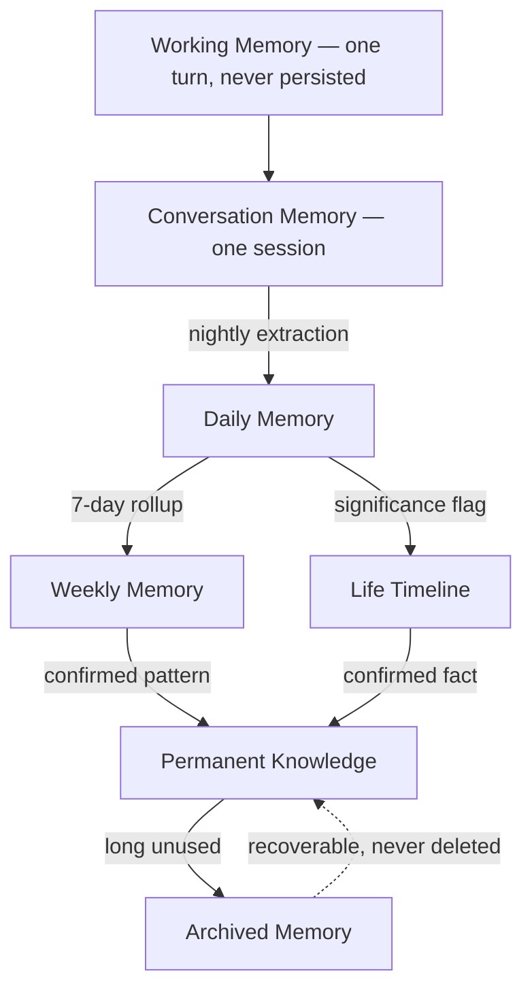
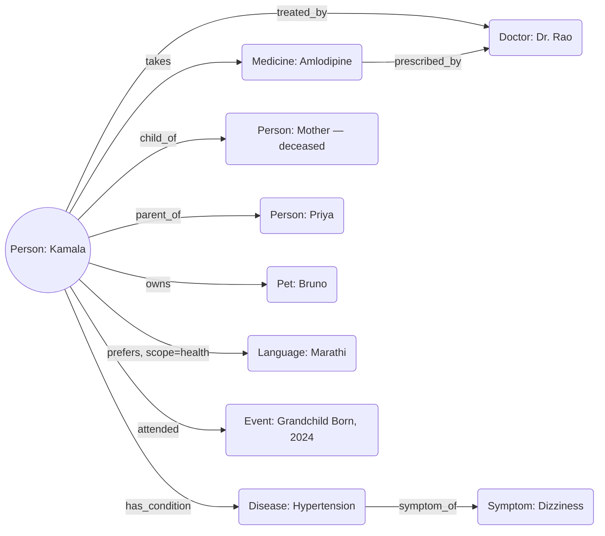

# LifeOS — Memory, Personalization & Lifelong Learning

*This document assumes [PHILOSOPHY.md](PHILOSOPHY.md), the PRD, and
[ARCHITECTURE.md](ARCHITECTURE.md) as final and immutable. It does not restate
or modify any of them. Its only job: how does LifeOS remember a person for
fifty years without ever confusing, surprising, or misrepresenting them?*

This is not a database design. It is not RAG. It is not chatbot conversation
history. No production code appears below.

---

## Table of Contents

1. [Human Memory Model](#1-human-memory-model)
2. [Memory Philosophy](#2-memory-philosophy)
3. [Memory Categories](#3-memory-categories)
4. [Memory Hierarchy](#4-memory-hierarchy)
5. [Knowledge Graph](#5-knowledge-graph)
6. [Life Timeline](#6-life-timeline)
7. [Habit Learning](#7-habit-learning)
8. [Memory Retrieval Engine](#8-memory-retrieval-engine)
9. [Context Engine](#9-context-engine)
10. [Memory Confidence](#10-memory-confidence)
11. [Memory Editing](#11-memory-editing)
12. [Privacy Architecture](#12-privacy-architecture)
13. [Memory Summarization](#13-memory-summarization)
14. [Memory Failure Modes](#14-memory-failure-modes)
15. [Lifelong Learning](#15-lifelong-learning)
16. [Scalability](#16-scalability)
17. [Technical Specification](#17-technical-specification)
18. [Acceptance Criteria](#18-acceptance-criteria)

---

## 1. Human Memory Model

A vector store of embedded conversation turns is not a memory system — it is
a search index over transcripts. It has no concept of time decay, no
distinction between fact types, no confidence, no forgetting, and nothing
prospective. Human memory research gives us a far better blueprint, because
it already solved "how does a finite system remember a whole life without
drowning in it."

| Human memory type | What it is | Maps to in LifeOS |
|---|---|---|
| **Working memory** | A few seconds of active, limited-capacity holding | The **Turn Context** (Architecture §5/§6) — exists only for the current conversational turn, never persisted |
| **Short-term memory** | Seconds to minutes, decays unless consolidated | **Conversation Memory** — the current session; decays at session end unless the Memory Agent extracts durable facts |
| **Procedural memory** | "How to do things" — habits performed without conscious thought | **Habit/Routine memory** (§7) — detected behavioral patterns, never physically "done" by LifeOS, but recognized and supported |
| **Semantic memory** | Timeless facts, independent of when/where learned | The **Knowledge Graph** (§5) and Identity/Relationship facts |
| **Episodic memory** | Specific events tied to a time and place | The **Life Timeline** (§6) |
| **Autobiographical memory** | Emotionally-weighted episodic memory forming life narrative and identity | Life Timeline entries tagged **significant** — weddings, births, losses — held to a higher retention bar than routine episodic entries |
| **Prospective memory** | Remembering to do something in the future | Literally the existing **Reminder/Planning system** (Architecture §1) — prospective memory is the cognitive-science name for exactly that |
| **Emotional memory** | The affective coloring that makes some memories vivid and others fade | An **emotional-valence tag** on every episodic/autobiographical entry, produced by the Emotion Agent, governing both retrieval priority and how gently a topic is approached |

**Why chatbot memory is insufficient.** A flat vector store fails on every
axis this document needs to solve:

- No **time decay or promotion** — a three-year-old fact about a now-deceased
  pet and "what we discussed two minutes ago" look identical to a similarity
  search.
- No **fact-type distinction** — "my daughter is Priya," "I feel sad today,"
  and incidental small talk are stored as the same kind of retrievable blob.
- No **confidence or provenance** — a hallucinated inference and a confirmed
  fact are indistinguishable once embedded.
- No **addressable editability** — "forget that I said X" has nothing
  structured to grab onto in a flat embedding space.
- No **prospective component** — nothing about a vector store knows to
  remind you of something in the future.
- No **consolidation** — human memory compresses a week into a pattern; a
  vector store just accumulates more vectors to search.

Everything in the remaining sections exists to fix these, structurally.

---

## 2. Memory Philosophy

> **Memory must help, not surprise.**

Any time a memory-driven statement makes someone think "how do you know
that?", the design has already failed. Every use of memory must be
explicable in one sentence if asked, and higher-sensitivity memories are
surfaced only in contextually appropriate moments — never dropped in cold.

> **Memory must always be editable.**

Every stored fact has a first-class forget/correct affordance, reachable by
simply saying "that's not right" mid-conversation — never buried three taps
deep in a settings menu.

> **Memory must expire when appropriate.**

Some facts have a natural shelf life. An upcoming appointment is irrelevant
the day after. "Feeling under the weather today" should not still color tone
three months later. Temporal validity is explicit, not implicit-forever.

> **The user owns every memory.**

Not a policy statement — an architectural property. Every record traces to
an owner with export/delete rights enforced at the data layer, not merely
promised in a document.

> **The AI must distinguish facts from assumptions.**

An inferred pattern ("seems to prefer tea, inferred from 4 mentions") is
categorically different from a stated fact ("said explicitly: I don't drink
coffee"). Conflating the two is how false confidence quietly accumulates
over a decade.

> **The AI must distinguish observations from user-confirmed facts.**

An observation requires an explicit or implicit confirmation gate before it
is treated with the weight of a confirmed fact — this is the governance
checkpoint on the entire confidence-propagation system (§10).

> **Memory must be legible, not just accurate.**

The person, or a consented caregiver, can always ask "why do you think
that?" and get a real, traced answer — never a black-box similarity score
dressed up as an explanation.

> **Silence is a valid memory action.**

Not every observation needs to become a stored fact. Over-collection is
itself a privacy and trust failure — the same restraint principle from the
Philosophy's AI Philosophy section, applied to memory specifically.

> **Correction outranks convenience.**

If a user's correction conflicts with a strongly-held prior inference, the
correction wins immediately — even at the cost of discarding a lot of
accumulated confidence. A person should never have to argue with their own
memory system.

---

## 3. Memory Categories

Grouped into nine clusters rather than a flat forty-item list, so the
taxonomy is navigable and so each cluster can be assigned a coherent
sensitivity tier and retention policy.

| Cluster | Includes | Memory type | Sensitivity |
|---|---|---|---|
| **Identity & Self** | Name, preferred name, birthdate, native language(s), literacy level, personality traits, communication style, fears, goals, dreams | Semantic | Medium |
| **People & Relationships** | Contacts, Family Tree, Friends, Doctors, Caregivers, Emergency Contacts | Semantic (graph) | Medium–High |
| **Health** | Medicines, Diseases, Appointments, Symptoms, Vitals trends, Allergies, Accessibility Needs | Semantic + episodic (trend) | **Highest** |
| **Daily Life & Routine** | Sleep, Meals, Prayer, Exercise, general Routine | Procedural | Low–Medium |
| **Interests & Culture** | Hobbies, Television, Music, Food, Language preference *(may differ by context — see §5)*, Culture, Religion | Semantic | Low |
| **Important Occasions** | Birthdays, Anniversaries, Important Dates, Festivals | Semantic + prospective | Low |
| **Belongings & Environment** | Pets, Home Layout, Devices, Financial *preferences* (never transactions), Shopping preferences | Semantic | Medium |
| **Life Story** | Life Events, Favorite Memories, Losses, Achievements, Travel | Autobiographical | High (emotional) |
| **Practical/Safety** | Emergency Contacts *(cross-listed)*, Accessibility Needs *(cross-listed)* | Semantic | High |

Four additions beyond the brief's own list, because a real memory system
needs them:

- **Correction history** — a running log of what the user has previously
  corrected, so the system does not re-make the same mistake.
- **Consent & sharing preferences** — who is allowed to see what; the data
  the Caregiver module's digest filter actually reads.
- **"Handle with care" topics** — a tag for subjects that reliably cause
  distress, directly serving the Philosophy's grief-handling stance.
- **Daily mood/affect baseline** — not a single fact but a rolling pattern,
  feeding both Health and the Emotion Agent.

---

## 4. Memory Hierarchy

| Transition | Rule |
|---|---|
| **Promotion** | Requires (a) repeated observation crossing a confidence threshold, (b) explicit user confirmation, or (c) high emotional/clinical significance flagged at the moment it happens — a one-time hospital visit does not need to "wait its turn" through the slow-build path |
| **Compression** | As data moves toward Weekly/Archived, raw transcripts are discarded; only the extracted structured summary persists — the same data-minimization rule already established in Philosophy |
| **Expiration** | Fact-type-specific validity windows ("upcoming appointment Tuesday" expires or resolves into a Life Timeline entry the moment it passes) |
| **Deletion** | User-initiated, permanent, enforced at the Persistence layer — the right to be forgotten |
| **Archival** | System-initiated for low-relevance-but-still-owned data, **always reversible** |
| **Recovery** | Re-promotion through the same pipeline when a new context makes archived data relevant again (an old friend's name resurfacing after years) — not a special-cased operation |

---

## 5. Knowledge Graph

A **property graph**, not a triple-store: nodes carry typed properties, and
edges carry their own properties — confidence, a temporal validity window,
and critically, a **context scope**, because real preferences are
context-dependent ("prefers Marathi *for health discussions specifically*,"
Hindi otherwise — a flat, unqualified edge cannot represent this).

| Edge category | Examples |
|---|---|
| Kinship | `parent_of`, `child_of`, `sibling_of`, `spouse_of`, `grandparent_of` |
| Care | `treated_by`, `cares_for`, `prescribed_by` |
| Health | `takes`, `has_condition`, `exhibits`, `symptom_of` |
| Social | `friend_of`, `calls_regularly` *(carries a frequency attribute)* |
| Ownership | `owns`, `lives_at` |
| Temporal/causal | `preceded_by` / `caused` (e.g., Surgery `preceded_by` Fall) |
| Preference *(context-scoped)* | `prefers` — always qualified by a scope attribute, never flat |

**Reasoning over the graph:**
- **Multi-hop queries** — "who should I call about her heart condition" walks
  `Person -[has_condition]-> Disease -[treated_by]-> Doctor`.
- **Consistency checking** — a new `spouse_of` edge conflicting with an
  existing one triggers reconciliation (§14), never a silent overwrite.
- **Temporal reasoning** — an old `lives_at` edge gets a `valid_until`
  timestamp when a new address is confirmed, rather than being deleted —
  history is preserved for the Life Timeline.

---

## 6. Life Timeline

Two fundamentally different kinds of entries, deliberately not conflated:

- **Discrete events** — Birthday, Hospital Visit, Marriage, Grandchild Born,
  Surgery, Friend Passed Away, Vacation, Appointments, Phone Calls. Single,
  dated, narrative occurrences.
- **Trend series** — Blood Pressure, Weight, Sleep, Pain Episodes, Mood,
  Walking, Falls. These are time-series data, not narrative events, and are
  stored/queried statistically ("trending up over 3 weeks"). Individual raw
  readings live in the Health module's own store; only periodic
  **trend-summary** entries (e.g., one "BP trend: stable, avg 130/85" per
  week) ever become Life Timeline-worthy. Treating a single BP reading the
  same as "Marriage" in one flat timeline would be a design mistake.

Every entry carries: timestamp/date-range, category, emotional-valence tag,
significance level, source, and links into the Knowledge Graph (a
"Grandchild Born" entry links to the new Person node it creates).

**Retrieval** by date range, by category, by related entity ("show
everything related to Dr. Rao"), or by significance (major-events-only for
"tell me about my life" vs. full detail for a specific date).

**Summarization** is incremental, not regenerative — a Lifetime Summary is
amended when a new high-significance entry appears, never fully
recomputed from scratch (§13).

---

## 7. Habit Learning

A habit starts as a low-confidence hypothesis after one or two occurrences
and only strengthens with **independent, repeated observation** — never
strengthens merely from being retrieved or displayed. This distinction
matters enough to state plainly: showing a fact fifty times is not the same
as confirming it fifty times.

| Concern | Rule |
|---|---|
| **False positives** | "Drank tea at 7am twice" is not a habit. A minimum occurrence count across a minimum time window is required before even *surfacing* a candidate, and even then it's offered, never asserted: "I've noticed you often have tea around 7am — should I remind you if you forget?" |
| **Confidence** | Rises with confirming observations, drops sharply on a disconfirming one, and never crosses into "confirmed fact" territory without an explicit or clearly-implicit user confirmation |
| **Adaptation** | Sustained deviation from a previously-confirmed pattern (a new medicine changing a routine) reopens the habit for re-confirmation rather than rigidly enforcing a stale pattern |
| **Forgetting obsolete habits** | No reinforcing observation for a long window (e.g., "watches Hanuman bhajans after dinner," stopped six months ago) decays the habit's confidence and eventually archives it — never deletes it outright |

---

## 8. Memory Retrieval Engine

Retrieval is a **multi-signal ranking function**, not a single similarity
search — explicitly not "just RAG."

| Signal | Role |
|---|---|
| Semantic relevance | One input signal among several, not the sole determinant |
| Recency | More recent facts generally weighted higher |
| Significance / emotional weight | Autobiographical entries can outrank a more "relevant" but mundane fact |
| Contextual match | Does this memory's associated context (time of day, location, who's present) match now? |
| Confidence | Higher-confidence facts preferred when candidates conflict |
| Invoking module's scope | Health Agent retrieval is scoped differently than general Conversation retrieval |

A weighted combination ranks candidates; a relevance threshold decides what
actually enters the Turn Context — avoiding both latency bloat and the
"memory must help, not surprise" failure of injecting oddly specific facts
irrelevantly. **Conflicting retrieved memories** (an old address and a new
one) are resolved toward the higher-confidence, more-recent entry, but the
conflict is surfaced to the Memory module for reconciliation (§14) rather
than silently hidden.

---

## 9. Context Engine

Distinct from retrieval ranking: the Context Engine sets the *lens* through
which retrieval happens.

| Context | Effect on memory |
|---|---|
| Medication window | Boosts Medicine-category retrieval, suppresses low-priority chit-chat memories |
| Family nearby | Suppresses sensitive health-detail retrieval from being spoken aloud unless that family member is an authorized listener |
| Driving (car surface) | Suppresses long/complex memory-laden responses in favor of terse, safety-focused ones |
| Emergency | Overrides normal ranking entirely — jumps straight to Emergency Contacts, conditions, allergies, and Doctor info |
| Sleeping | Suppresses non-urgent memory-driven prompts entirely |

---

## 10. Memory Confidence

| Source | Default confidence |
|---|---|
| User explicitly said | 95% |
| Imported from medical record | 98% |
| Imported from caregiver | 90% |
| AI inferred (pattern observation) | 40% |
| User denied | 0% |

**Propagation rules:**
- Confidence rises with independent confirming observations, drops sharply
  on contradiction.
- Perishable fact-types (current mood) decay confidence quickly on their
  own; stable fact-types (date of birth) do not decay at all.
- An explicit correction **resets confidence immediately** to the
  correction's own source-confidence, overriding whatever accumulated
  before it.
- Confidence **propagates through inference chains**: a fact derived from
  two other facts inherits a confidence no higher than the weaker of its
  two sources — this prevents compounding false certainty across chained
  inference.

---

## 11. Memory Editing

| Interaction | Mechanism |
|---|---|
| **"Forget this"** | Resolves to the most recently discussed/retrieved item by default; confirms before permanent deletion ("I'll forget that you mentioned feeling tired yesterday — is that right?"); logged to correction history |
| **"Correct this"** | Replaces a value while preserving a version-history entry (old value, timestamp, corrector) rather than silent overwrite |
| **"Show what you know about me"** | A full, human-readable, browsable view of Permanent Knowledge + summarized Life Timeline, organized by §3's clusters — always available, never buried |
| **"Why did you remember this"** | Every surfaced memory traces to a stored provenance chain (source, confidence, when learned) and is explained in plain language — never synthesized after the fact, which would itself be a hallucination risk |
| **"Delete everything"** | A genuine right-to-erasure flow with an explicit confirmation given its irreversibility — and critically, this must **never** silently also disable Planning-layer safety schedules (medicine reminders) without its own distinct, deliberate confirmation. Frustration on a hard day should not accidentally turn off a medicine alarm |
| **Undo** | A short-window, low-friction undo for the *most recent* correction/deletion only — not a general infinite undo stack |
| **Version history** | Every Permanent Knowledge fact and Knowledge Graph edge carries a change log, viewable by the user/caregiver — the audit trail required by Architecture's "every action must be verifiable" principle |

---

## 12. Privacy Architecture

| Tier | Treatment |
|---|---|
| Local-only | Raw transcripts pre-summarization, precise real-time location, anything explicitly marked private |
| Encrypted at rest | Everything in Permanent Knowledge / Life Timeline / Knowledge Graph, via keystore-backed encryption (Architecture §15) |
| Cloud-synced | Only what multi-device continuity needs, household-scoped and end-to-end encrypted, opt-in only, never default |
| Shared with caregiver | A strictly consent-filtered digest (Architecture §4/§9) — never raw access to the memory store |
| Medical | Highest sensitivity — a **separate, explicit consent toggle** from general sync, even if general sync is enabled |
| "Handle with care" | Governs both retrieval suppression (§9) and sharing — never included in a caregiver digest without its own explicit consent |
| Family permissions | Capability-based, not a flat "family" level — a spouse and a distant adult child may see different things |
| Retention | Explicit per-tier windows (Conversation: days; Daily/Weekly: months; Life Timeline/Permanent: indefinite until user-deleted; Archived: indefinite, compressed) |

**What never leaves the device, explicitly:**
- Raw audio recordings — deleted immediately after transcription.
- Raw, pre-summarization transcripts — purged nightly by the Summarization
  Agent.
- Precise real-time location — only last-known-on-request is ever used
  (Architecture's Emergency flow); no continuous tracking.
- Anything explicitly tagged private.
- Raw contents of "handle with care" memories, absent a specific, separate
  consent for a specific caregiver relationship.

---

## 13. Memory Summarization

| Summary | Trigger |
|---|---|
| Conversation | End of session (natural silence/goodbye/topic change) |
| Daily | Nightly batch |
| Weekly | Rollup of 7 daily summaries |
| Monthly | Rollup of ~4 weekly summaries |
| Yearly | Rollup of ~12 monthly summaries + a re-scan of significant Life Timeline entries |
| Lifetime | **Incrementally amended**, not regenerated, whenever a new high-significance Life Timeline entry appears |
| Health | Regenerates on an Observation-count threshold, or ahead of a known appointment ("prepare a summary before her appointment Tuesday") |
| Relationship | Regenerates when a person's Knowledge Graph edges change significantly |

---

## 14. Memory Failure Modes

| Failure | Detection | Correction / Recovery |
|---|---|---|
| Duplicate contacts | Entity resolution at ingestion (shared phone number, similar name + shared edges) surfaces a merge prompt before creating a new node | Merge, don't auto-duplicate or auto-merge silently |
| Contradictory information (two addresses) | Knowledge Graph consistency check on write | Proactively asks: "I have two addresses for you — which is current?" — never silently picks one |
| Wrong birthday / wrong medicine | User correction flow (§11) | Corrected value + version history entry |
| Hallucinated memory | Any AI-inferred fact never independently confirmed is flagged for periodic re-validation — **repeated retrieval never itself raises confidence**, only repeated independent observation or explicit confirmation does | Downgrade or discard on re-validation failure |
| Incorrect relationship edge | Consistency check against existing edges of the same type | Reconciliation prompt, versioned change |
| Old address held past relevance | Temporal validity window (§5) | Old edge marked `valid_until`, preserved for history, not deleted |

---

## 15. Lifelong Learning

Personalization lives entirely in the **data** — the Memory Layer and
Knowledge Graph — never in model weights. The same stateless, swappable
model (Architecture §10, "Stateless AI") produces personalized behavior
because it is given a rich, structured, person-specific Turn Context, not
because it was fine-tuned per-person. This is what makes personalization
survive a provider swap unchanged, and it is the direct technical
consequence of Architecture's Stateless AI principle applied to this domain.

**Boundaries — preventing unsafe personalization:**
- Safety-critical behaviors are **not** subject to habit-learning override.
  If someone repeatedly asks LifeOS to skip logging a missed dose, the
  system does not "learn" to stop flagging missed doses — that logic lives
  in the deterministic Planning/Safety layers, entirely outside the
  learnable-preference space.
- Personalization never learns to reduce a genuine safety escalation "to
  keep the user happy."
- Language and communication adaptation affects **how** something is said,
  never **whether** a safety-critical thing is said at all.

---

## 16. Scalability

| Horizon | Implication |
|---|---|
| 1 year | Modest volume, fits comfortably in local encrypted storage, no special compression needed yet |
| 10 years | The compression/archival pipeline (§4) becomes essential — without it, a decade of daily conversation is an unbounded, ever-growing raw store |
| 50 years | Genuinely a whole-life scale. The Archived tier needs real cold-storage efficiency, and Lifetime Summary's incremental-update design (§13) is what keeps "tell me about my life" fast without re-scanning fifty years each time |
| Millions of memories (across users) | Solved by never centralizing raw memory into one shared global store — the household-scoped model (Architecture §13) serves both privacy and genuine multi-tenant scale |
| Multi-device / offline sync | Reuses Architecture §7's durable Event Bus + replay — a new device reconstructs memory state by replaying the log, no bespoke memory-sync protocol needed |
| Family shared memory | **Not** a shared database. Each family member sees a permission-scoped *view* into the elder's graph — never a merged store. This preserves "the user owns every memory" even as the family circle grows |

---

## 17. Technical Specification

**Memory architecture pattern.** A hybrid: **Knowledge Graph as source of
truth for structured facts and relationships + a vector index over
summarized natural-language entries for fuzzy conversational recall**,
unified by a common entity-ID scheme, with an event-sourced log underneath
both for auditability, replay, and sync. Rejected alternatives: pure-RAG
(loses structure, confidence, editability — explicitly the thing this
document is not); pure relational/SQL (too rigid for an open-ended "remember
anything about a life" domain); pure knowledge-graph-only (weak at fuzzy
conversational recall, which vector search is genuinely good at).

**Knowledge graph strategy.** Property graph, not RDF triples — practical
for a personal-scale graph (thousands to tens of thousands of nodes over a
lifetime, not web-scale), and naturally supports edge properties (confidence,
validity window, context scope) that a plain triple-store handles
awkwardly.

**Vector search strategy.** Embeddings generated only over summarized,
structured entries — never raw transcripts. A local, on-device index sized
for thousands (not millions) of entries per person keeps retrieval fully
offline-capable, consistent with Architecture's offline-first principle.

**Hybrid retrieval strategy.** A query router classifies a query's shape
(structured-lookup vs. fuzzy-recall vs. both) and invokes graph traversal,
vector similarity, or both — never always-both (wasteful) or always-one
(insufficient coverage).

**Entity resolution.** Exact identifiers (phone number, explicit name match)
plus fuzzy signals (shared relationship edges, similar name + same
household); ambiguous matches surface for confirmation, never auto-merge or
auto-duplicate.

**Conflict resolution.** The standing rule from §§2/10/14: recency +
confidence + explicit-correction-always-wins, applied consistently.

**Compression strategy.** The hierarchy's promotion/summarization pipeline
(§4/§13) *is* the compression strategy — raw data compresses into structured
summaries as it ages, rather than generic lossless byte-compression of blobs.

**Embedding strategy.** A swappable `Embedder` capability following the same
Dependency Inversion principle as Architecture §10's AI providers — a
decade-long memory store must not be hard-tied to one embedding model.
Enough structured metadata is retained alongside embeddings that a full
re-embedding pass is possible without data loss if a better model appears.

**Metadata schema.** Every record carries: entity/fact ID, category (§3),
memory type, confidence (§10), source/provenance, created/last-confirmed/
valid-until timestamps, sensitivity tier (§12), and links to related
Knowledge Graph nodes.

**Indexing strategy.** By entity ID (graph traversal), by category
(browsing), by time range (Life Timeline queries), and the vector index for
fuzzy recall — multiple indexes over one underlying store, not separate
stores.

**Storage abstraction.** A storage-agnostic interface so the underlying
engine can evolve without touching consumers. Trade-off explicitly noted: an
embedded, on-device-friendly graph-capable store is preferred over a
heavyweight server-based graph database — a "run a Neo4j server" pattern is
the wrong shape for an offline-first, one-user-per-phone deployment, even
though it's a common enterprise default.

**Synchronization model.** Event-log replay, not a bespoke CRDT merge
system — simpler to reason about and sufficient at household-scale
concurrency (a handful of devices, not thousands of concurrent writers). A
true CRDT would handle concurrent conflicting edits more gracefully, but the
complexity isn't justified at this system's actual scale.

**Caching strategy.** Frequently-retrieved high-confidence facts (identity,
standing emergency contacts) are kept warm in an in-memory cache, refreshed
on any write, rather than re-querying the full store every turn.

**Retention & backup.** Per-tier defaults from §4/§12, user-adjustable.
Encrypted local backup + optional encrypted cloud backup (opt-in),
restorable via the same event-log replay that supports multi-device sync —
no second bespoke backup format.

**Versioning.** Every fact and edge carries a change log — the mechanism
underlying "undo," audit, recovery, and conflict resolution across the
entire system, not a UI feature bolted on separately.

---

## 18. Acceptance Criteria

| Metric | Definition | Target |
|---|---|---|
| Memory precision | Fraction of asserted "known" facts that are actually correct | >98% for Permanent Knowledge tier specifically |
| Memory recall | Fraction of facts a person would expect retrievable, that actually are | High — guards against silent data loss or over-aggressive expiration |
| False memory rate | Rate of hallucinated (never stated/confirmed) facts appearing in retrieval | As close to zero as possible — the single most trust-critical metric here |
| Personalization score | Measured improvement in response relevance/appropriateness vs. a no-memory baseline | Internal benchmark, tracked over time |
| Retrieval latency | p50/p95 time from retrieval request to ranked results | <150ms, matching Architecture §6's Memory Retrieval stage budget |
| Storage efficiency | Bytes-per-year-of-relationship growth rate | Validates the hierarchy keeps 10/50-year storage bounded, not linear with raw interaction volume |
| Explainability score | Fraction of surfaced memories with a correct, on-request provenance explanation | Near 100% — provenance is stored metadata, never synthesized after the fact |
| User trust score | Direct, periodic, validated survey — not a proxy metric | Echoes Philosophy §11's Trust metric — the real test of everything in this document |
